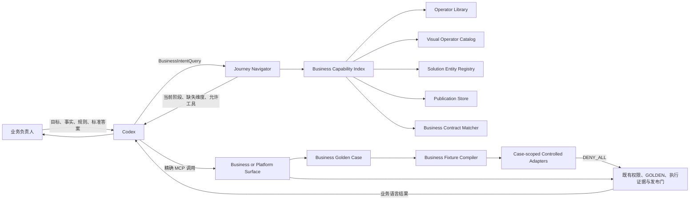

# Resource Gateway 产品技术演进详细设计方案 v1.4.6：业务语义召回、工作流导航与受控测试

> 状态：待审阅。本文承接 v1.4.5 已实现的四实体运行时、业务工作台、工程交接、业务审阅、测试治理和运营回流，但不把本文方案写成已交付事实。v1.4.6 解决两个已经被真实使用暴露的问题：Codex 能看到严格的 MCP 工具契约，却缺少稳定的业务能力发现和工作流导航；业务负责人能够给出标准答案，却缺少用业务语言表达测试假设和依赖结果的一等入口。

## 1. 结论与目标

v1.4.5 已能阻止无权限执行、错误 DSL、未经批准的 Oracle 和缺少签署的发布，但“错误操作会被拦住”不等于“业务意图一定召回正确能力”。当前系统把两类不同问题混在一起：

1. **工作流工具召回**：Codex 当前应该调用 `rg.feature.define`、`rg.feature.compose`，还是先继续询问业务事实。
2. **业务能力召回**：业务负责人说“取消责任方”时，Codex 应该复用哪个 Feature、API 或库算子，以及它是否与当前业务口径完全一致。

v1.4.6 的目标是把“模型大概率选对”提升为“平台返回可复核候选，歧义时不能继续，下一步由当前状态确定”。业务负责人仍只表达目标、事实、规则和标准答案，不需要知道 MCP 工具名、资产引用、Schema、DSL 或 binding。

### 1.1 目标

- Codex 从一个稳定的业务前门开始，而不是在 42 个工具中自行猜入口。
- RG 在同一认证 scope 内统一发现 Feature、Scenario、Instruction、Solution、库算子、资源和已发布能力。
- 业务能力必须携带可比较的业务语义，不再只靠技术引用或一段自由文本匹配。
- 服务端根据持久化状态返回当前阶段、阻塞原因和允许的下一步工具。
- 业务负责人用业务语言提出事实值、依赖结果和预期处置；平台将这些内容编译为零外呼的受控测试计划。
- 明确区分业务 Solution 创作面和底层 Tool/Graph 开发面，避免近义工具竞争。
- 通过真实 Codex 业务话语集验证工具召回、能力召回、澄清行为和操作顺序。
- 保持 v1.4.5 的权限、零载荷、工程交接、GOLDEN、执行证据和发布治理边界不变。

### 1.2 非目标

- 不在 RG 内建设通用自然语言模型或对话引擎。
- 不用 embedding 分数替代契约比较或业务批准。
- 不合并现有各类资产的写模型；统一的是只读发现投影，不是底层存储。
- 不让 RG 代替业务负责人决定模糊或冲突的业务口径。
- 不把底层 Tool/Graph 能力删除；只改变业务会话的默认可见范围。
- 不把通过 Schema、编译或 Feature 单测描述为业务正确性证明。

### 1.3 针对性提升计划

| 阶段 | 直接修复的缺口 | 核心交付 | 阶段门 |
|---|---|---|---|
| P0 目录真相统一 | 说明引用不存在的工具 | 真实 overview MCP、说明生成器、目录一致性测试 | 文档、配置、目录和分发器零漂移 |
| P1 Surface 隔离 | 业务和底层工具同屏竞争 | BUSINESS_SOLUTION、PLATFORM_AUTHORING、OPERATIONS | 业务会话不能列出或调用底层 Tool/Graph 工具 |
| P2 统一能力索引 | 四实体和算子分散、跨会话不可发现 | capability search、entity list/get、冻结快照 | 所有资产可在同一 scope 搜索并抵抗上下文漂移 |
| P3 结构化业务语义 | 名称和自由文本不能证明业务一致 | 语义契约族、semantic key、字段级 matcher | EXACT、PARTIAL、CONFLICT 可解释且可测试 |
| P4 Journey 与受控测试 | 顺序依赖提示词记忆；业务假设依赖底层 stub | start/next、状态派生、业务 GOLDEN、受控假设编译、原子 association | 前置条件不满足时拒绝推进；测试执行无法外呼 |
| P5 真实召回认证 | 单一旧证书不能证明当前主线 | 业务话语集、干扰项、跨会话、假设测试、与待验收 HEAD 同生产树和认证输入的证书 | §14.4 指标全部通过 |

实施严格按 P0 → P5 推进。每阶段独立提交、独立验证；后阶段不得用提示词补丁掩盖前阶段尚未完成的服务端契约。

## 2. 基线事实与问题分级

### 2.1 当前已交付能力

| 范围 | 当前事实 | v1.4.6 处理方式 |
|---|---|---|
| MCP 目录 | 42 个工具，每个工具有名称、标题、描述、输入和输出 Schema、影响级 | 保留现有工具；增加业务前门工具和目录一致性检查 |
| 权限 | READ、DRAFT_WRITE、PROPOSE、EXECUTE、RUNTIME_EXECUTE、GOVERNED_WRITE 分级鉴权 | 不改变权限含义；业务 surface 只能缩小可见范围，不能扩大权限 |
| 四实体 | Feature、Scenario、Instruction、Solution 已有持久化和运行时 | 纳入统一业务能力索引和读取面 |
| DSL | 已有 scoped reference、preview、诊断修正、gate 和收据指纹 | 保持为底层创作机制，不作为业务能力发现入口 |
| 治理 | GOLDEN、maker-checker、RED/GREEN、实景证明、签署和发布门已具备 | 工作流导航只读取这些事实，不绕开任何门 |
| 测试缝 | Scenario/Solution 可消费预采集 Feature 值；WRITE Instruction 在 SIMULATE 下使用契约桩；GraphDraft 支持 node-level dependency behavior | 复用执行底座；新增业务假设解析、冻结绑定和全依赖零外呼边界 |
| 真实 Codex | 有一条业务提示词到 Tool 草稿的真实认证 | 扩展为覆盖四实体、同义词、干扰项、歧义和跨会话的召回测试集 |

### 2.2 P0：目录事实必须唯一

当前 MCP 初始化说明和 Codex 配置要求调用 `rg.library.overview.get`，但 `McpToolCatalog` 和 `ResourceGatewayAgentTddTools` 没有该工具。实际能力只存在于 HTTP 看板接口 `/api/agent-tdd/library-overview`。

影响：Codex 按服务端说明执行仍会找不到入口；文档、配置、目录和分发器可以各自“测试通过”，整体却不可用。

修复原则：

- `McpToolCatalog` 是工具名称、影响级和 Schema 的唯一事实源。
- `rg.library.overview.get` 正式进入 MCP READ 面，复用现有 `AgentTddLibraryOverviewService`。
- 初始化说明由工具常量和工作流策略生成，不再手写工具名。
- Codex 配置、操作手册和认证脚本中的 `enabled_tools` 必须接受目录一致性测试。
- 任何说明中出现、但目录不存在的 `rg.*` 名称都使构建失败。

### 2.3 P1：业务资产存在，但不能统一发现

`rg.capability.list` 当前扫描库算子、运行时算子和 GraphDraft；四实体则保存在 `SolutionEntityRegistry`。因此，刚定义的原子 Feature 可能无法在后续会话通过能力目录重新发现。当前也没有完整的 `rg.feature.get/list`、`rg.scenario.get/list`、`rg.instruction.get/list` 和 `rg.solution.list`。

影响：无法稳定执行“先找已有能力，完全匹配则复用，不匹配才新建”；跨会话后只能依赖 Codex 记住引用。

修复原则：建立 `BusinessCapabilityIndex` 只读投影，同时读取现有 registry、catalog 和 publication store，不改变各自写入边界。

### 2.4 P1：能力语义不足，无法证明“业务上相同”

`OperatorDefinition.Display` 已有名称、描述和标签，但 `rg.capability.list` 的库算子投影没有输出这些字段。Feature 只有一段 `businessSemantics`，缺少业务对象、判断时点、结果范围、不可判断处理、取值责任和权威来源等可比较字段。

影响：技术类型一致的两个能力可能具有不同业务口径；Codex 只能凭名称猜测，RG 无法判断 EXACT、PARTIAL 或 CONFLICT。

修复原则：引入结构化 `BusinessSemanticContract` 族，并以对应资产类型的业务语义作为复用判定和契约指纹的一部分。

### 2.5 P1：业务主线和底层创作面互相干扰

当前同一 `rg_author` 会话同时暴露：

| 业务 Solution 主线 | 底层 Tool/Graph 主线 | 误用风险 |
|---|---|---|
| `rg.feature.define` | `rg.feature.compose` | 原子业务事实和 Feature 图同名竞争 |
| `rg.scenario.define` | `rg.scenario.upsertCases` | 业务规则定义和测试数据维护混在同一选择面 |
| `rg.solution.baseline` | `rg.tool.baseline` | 两种基线对象相似，输入和治理线不同 |
| `rg.solution.readiness` | `rg.readiness.get` | Solution 和 Tool 发布门容易混淆 |
| `rg.solution.publish` | `rg.tool.publish` | 发布对象选错会进入另一条治理线 |

影响：Schema 可以拒绝参数错误，但无法阻止 Codex 先选择了错误的产品模型。

修复原则：权限和产品 surface 分开建模。purpose 决定能不能做，surface 决定当前会话应该看见什么。

### 2.6 P1：工作流顺序依赖长提示词，没有服务端状态导航

v1.4.5 的初始化说明要求 Codex 补齐业务事实、生成四实体并遵守两个人工门，但 RG 没有返回“当前处于哪一幕、还缺什么、下一步只允许哪些工具”的 MCP 契约。看板有 journey 投影，但它不是 Codex 的工作流控制面。

影响：模型升级、上下文压缩、跨会话或提示词改写后，Codex 可能过早定义 Feature、跳过重新读取契约，或在工程交接未完成时继续组合 Solution。

修复原则：新增持久化 `BusinessJourney` 和只读 `rg.journey.next`，由服务端根据当前资产和门禁事实计算下一步。

### 2.7 P1：业务测试假设没有业务入口

现有底座提供三条独立测试路径：Scenario 和 Solution 测试直接消费调用方提供的 Feature 值；`InstructionCallOperator` 在 SIMULATE 模式下只为 WRITE Instruction 生成契约桩；Tool/Graph 测试通过 `nodeId` 设置 dependency behavior。这些路径没有统一的业务语义，也没有按 journey 冻结 Feature、Instruction 和实现绑定。

影响：业务 surface 隐藏 node、stub、fixture 和 Graph 工具后，业务负责人只能给出 `givenFacts` 和预期结果，不能表达“某个事实返回什么”“某个依赖不可用”“某个业务动作成功但不产生真实效果”。Codex 可能退回底层工具，或把业务名称猜成 node。

修复原则：新增 journey-scoped `BusinessGoldenCase` 和 `BusinessFixtureCompiler`。业务负责人只表达事实、依赖结果和预期处置；服务器在当前 Solution 冻结上下文中解析对应 Feature 或 Instruction，并生成不可外呼的 `ControlledAssumptionPlan`。

### 2.8 P2：真实认证不能证明普遍召回能力

现有证书证明一个固定业务提示曾驱动真实 Codex 依次调用 capability、contract、DSL、compose 和 case 工具，但证书对应的代码提交早于当前四实体主线，且没有覆盖：

- 同一意图的不同说法。
- 多个相似能力同时存在。
- 信息不完整时主动澄清。
- 四实体 Solution 主线和底层 Tool 主线的选择。
- 跨会话重新发现已有 Feature。
- 能力发生语义漂移后的重新确认。

修复原则：认证对象从“固定工具序列成功”扩展为“业务意图、候选能力、选择理由、工具顺序和人工停点一致”。

## 3. 核心设计决策

### 3.1 D1：Codex 理解自然语言，RG 证明可复用性

采用混合边界：

- Codex 负责把多轮业务对话整理为结构化 `BusinessIntentQuery`。
- RG 负责 scope 过滤、候选召回、字段级契约比较、状态验证和稳定排序。
- RG 不根据模型分数直接选择能力。
- 如果存在业务歧义，RG 返回缺失维度和一个业务问题；Codex 不得继续创作。

该决策保留 v1.4.5“NL → 四实体归 Agent”的边界，但修正了“平台只提供原始目录就足够”的错误假设。

### 3.2 D2：统一读模型，不统一写模型

不把 OperatorLibrary、VisualOperatorCatalog、SolutionEntityRegistry、GraphDraft 和 publication store 合并成一个大仓储。新增 `BusinessCapabilityIndex`，每次从同一 scope 的冻结快照生成统一投影。

理由：

- 各写模型的生命周期和治理责任不同，强行合并会扩大事务和迁移风险。
- 召回需要统一语义，不要求统一底层存储。
- 投影可重建，索引故障不应破坏权威业务契约。

### 3.3 D3：结构化契约是权威，语义排序只扩大候选集

召回采用三段式：

1. 别名、标签和领域词做候选召回。
2. 可选 `SemanticCandidateRanker` 调整候选顺序。
3. `BusinessContractMatcher` 按结构化字段做 EXACT、PARTIAL、CONFLICT 判定。

embedding、模型分数和文本相似度都不能直接产生 `reuseAllowed=true`。只有结构化契约完全一致、状态允许且无冲突时，能力才可复用。

### 3.4 D4：业务 surface 是服务端约束，不只靠 Codex 配置

新增请求头 `X-RG-Surface`：

- `BUSINESS_SOLUTION`：四实体创作、测试、审阅、发布和运行。
- `PLATFORM_AUTHORING`：库、资源、DSL、GraphDraft 和 Tool 创作。
- `OPERATIONS`：只读运营和证据查询。
- `LEGACY_ALL`：兼容旧客户端，受配置开关和弃用期约束。

surface 只能缩小当前 purpose 已允许的工具集合，不能授予新权限。`tools/list` 只返回当前 surface 可见工具，`tools/call` 对不可见工具返回稳定错误，防止客户端绕过列表直接调用。

### 3.5 D5：工作流导航基于服务端事实，不基于 Agent 自报进度

`rg.journey.next` 从 BusinessJourney revision、四实体 revision、handoff、GOLDEN、evidence、readiness 和 publication 派生下一步。客户端提交的 `stage` 仅用于并发检查，不能改变服务端状态。

### 3.6 D6：业务专家不选择技术候选

业务负责人只确认：

- 业务事实定义是否正确。
- 多个业务口径之间应该采用哪一个。
- 规则和标准答案是否正确。
- 是否签署发布。

Codex 可以说明候选的业务差异，但不得展示技术 binding、Schema、内部引用或相似度分数。技术候选选择由结构化契约和当前状态完成。

### 3.7 D7：业务案例与执行替身分层

业务负责人批准的是完整业务案例，不是 fixture、stub 或 node 配置。`BusinessGoldenCase` 保存业务意图、给定事实、依赖假设和预期结果。`ControlledAssumptionPlan` 是服务器根据当前 journey 和 Solution 上下文生成的执行期对象，不属于业务契约，也不能跨 journey 复用。

该分层解决两个问题：

- 业务语言不会泄漏底层 Graph 结构。
- Feature 或 Instruction 的业务契约变化后，旧批准自动失效；实现或绑定变化只使旧执行计划和证据失效。

## 4. 目标架构



### 4.1 新增组件

| 组件 | 责任 | 不负责 |
|---|---|---|
| `BusinessCapabilityIndex` | 聚合当前 scope 内的业务能力卡片，冻结快照，稳定排序 | 不修改权威资产，不执行能力 |
| `BusinessContractMatcher` | 比较业务对象、上下文、结果范围、时点、失败处理、来源责任和 effect | 不根据文本相似度批准复用 |
| `BusinessJourneyService` | 创建 journey，派生阶段、阻塞原因和下一步 | 不批准 Oracle，不签署发布 |
| `McpSurfacePolicy` | 根据 `X-RG-Surface` 和 purpose 过滤目录及调用 | 不替代身份鉴权 |
| `McpAgentInstructionRenderer` | 从目录和 journey policy 生成初始化说明 | 不包含业务实例数据 |
| `SemanticCandidateRanker` | 可选排序适配器 | 不成为一致性或治理事实源 |
| `SolutionAuthoringContextService` | 冻结 journey 内四实体 revision、业务契约指纹和 lowering/compiler 版本 | 不向业务 surface 暴露 DSL 参考 |
| `BusinessFixtureCompiler` | 将已批准业务案例编译为冻结的 Feature 值、Instruction 替身和禁止调用断言 | 不读取真实业务依赖，不批准案例 |
| `ControlledFeatureAdapter` | 按计划提供契约校验后的 Feature 值或稳定失败 | 不进入真实 `FeatureEvaluationBackend` |
| `ControlledInstructionAdapter` | 按计划返回无副作用结果或拒绝计划外调用 | 不进入真实 `InstructionDispatchChannel` |

### 4.2 不变量

1. 所有候选必须来自当前认证的 tenant、project 和 environment。
2. 所有候选必须属于同一冻结索引快照。
3. `reuseAllowed=true` 必须同时满足 `matchType=EXACT`、状态可用和契约指纹仍为当前值。
4. PARTIAL、CONFLICT、多个 EXACT 都必须停下并询问业务问题。
5. `rg.journey.next.allowedNextTools` 只能包含当前 surface 和 purpose 可见工具。
6. journey 不得把工程履约、Oracle 批准、签署或平台证明标记为 Agent 已完成。
7. 索引、导航和遥测不得存储业务 payload、用户样本、DSL source、token 或异常原文。
8. 目录说明、Codex 配置、分发器和文档中的工具名必须可由构建期检查证明一致。
9. 业务案例只属于当前 journey，不进入跨 journey 能力索引。
10. 人工批准必须绑定完整案例和所引用的业务契约，不能只绑定预期结果，也不能绑定会随修复变化的实现 revision。
11. 受控测试必须在 `DENY_ALL` 外呼权限下运行，READ 和 WRITE 依赖都不能进入真实后端。
12. 测试计划只能使用一次冻结的 Feature、Scenario、Instruction 和 Solution 契约，执行阶段不得二次解析可变 registry。

## 5. 业务语义模型

### 5.1 `BusinessFactSemanticContract`

```jsonc
{
  "schemaVersion": "rg.businessFactSemanticContract.v1",
  "semanticKey": "ride-cancellation.responsibility-party",
  "intent": "判断出行订单的取消责任主体",
  "domain": "ride-cancellation",
  "businessObject": "ride-order",
  "requiredContext": [
    {
      "semanticKey": "ride-order.id",
      "name": "orderId",
      "meaning": "待处理的出行订单编号",
      "type": "string",
      "required": true
    }
  ],
  "resultDomain": {
    "type": "enum",
    "values": [
      { "code": "PASSENGER", "label": "乘客责任" },
      { "code": "DRIVER", "label": "司机责任" },
      { "code": "PLATFORM", "label": "平台责任" },
      { "code": "UNKNOWN", "label": "暂时无法判断" }
    ]
  },
  "asOf": "CANCELLATION_OCCURRED_AT",
  "unknownPolicy": "REQUIRE_HUMAN_REVIEW",
  "acquisitionOwner": "PLATFORM",
  "authoritySource": "ride-responsibility-center",
  "freshness": {
    "mode": "AS_OF_EVENT",
    "maxAgeSeconds": 0
  },
  "effect": "READ"
}
```

发现用显示信息独立于业务契约：

```jsonc
{
  "schemaVersion": "rg.businessCapabilityDisplay.v1",
  "businessName": "取消责任方",
  "description": "判断出行订单由乘客、司机还是平台承担取消责任",
  "aliases": ["取消归责", "谁导致取消", "责任判定"],
  "tags": ["取消费", "责任认定"],
  "whenToUse": ["计算取消费前需要确认责任主体"],
  "whenNotToUse": ["交通事故责任认定"]
}
```

`BusinessCapabilityDisplay` 只参与候选召回和业务展示，不进入 Feature 业务契约指纹。改名称、别名或说明不会让 GREEN、signoff 和 publication 失效；改变 `BusinessFactSemanticContract` 的任一业务字段则必须生成新契约 revision，并使旧证据按现有 fingerprint 规则失效。

实现将显示契约保存到独立的 `SOLUTION_CAPABILITY_DISPLAY` 资产行。该资产行使用自己的 `revision` 和 `displayFingerprint`，并纳入能力索引 generation vector。Feature、Scenario、Instruction 和 Solution 主资产不存储显示契约。仅修改显示契约时，主资产 revision、contract fingerprint 和 implementation fingerprint 保持不变，已批准案例与当前执行证据继续有效。

### 5.2 语义契约族

统一索引使用共同 envelope：`schemaVersion + semanticKey + intent + domain + businessObject`，再按资产类型使用不同 profile。不同 profile 之间可以参与候选召回，但不能互相判为 EXACT。

| 资产类型 | 语义 profile | 决定 EXACT 的主要字段 |
|---|---|---|
| Feature | `BusinessFactSemanticContract` | requiredContext、resultDomain、asOf、unknownPolicy、acquisitionOwner、authoritySource、freshness |
| Scenario | `BusinessScenarioSemanticContract` | inputFactKeys、decisionPolicy、outletSemanticKeys、otherwisePolicy |
| Instruction | `BusinessInstructionSemanticContract` | requiredFactKeys、resultDomain、reasoningPolicy、effect、failurePolicy、writeGovernanceClass |
| Solution | `BusinessSolutionSemanticContract` | problemClass、requiredFactKeys、scenarioSemanticKey、dispositionSemanticKeys、runtimeUse |
| Operator/Tool | 对应 Feature 或 Instruction profile | 端口映射到业务 fact key；无法映射时最多 PARTIAL |

Scenario、Instruction 和 Solution 的现有契约字段继续是运行时权威；semantic profile 是它们用于发现和比较的规范化业务投影。两者计算一个联合 contract fingerprint，任一业务关键字段变化都使旧召回上下文和相关证据失效。

### 5.3 Feature 字段约束

| 字段 | 必填 | 召回作用 | 缺失处理 |
|---|---|---|---|
| `semanticKey` | 是 | 绑定经治理的业务概念身份 | 查询未提供时可召回，但不能仅凭文本判为 EXACT |
| `intent` | 是 | 说明事实解决的问题 | 拒绝保存 |
| `domain` | 是 | 限制跨领域误召回 | 缺失时只能 PARTIAL |
| `businessObject` | 是 | 区分订单、账户、司机等对象 | 不一致为 CONFLICT |
| `requiredContext` | 是 | 比较所需业务上下文 | 缺少必填项为 PARTIAL；类型冲突为 CONFLICT |
| `resultDomain` | 是 | 比较结果类型和值域 | 不一致为 CONFLICT |
| `asOf` | 是 | 区分当前状态、事件时点和历史口径 | 缺失或不同为 CONFLICT |
| `unknownPolicy` | 是 | 规定无法判断时的业务处理 | 不一致为 CONFLICT |
| `acquisitionOwner` | 是 | 区分用户提供、Agent 采集、平台求值 | 不一致为 CONFLICT |
| `authoritySource` | 条件必填 | 指定平台求值的权威来源类别 | PLATFORM 且缺失时不能 EXACT |
| `freshness` | 条件必填 | 判断值是否仍可用于当前决策 | 需要实时或事件时点时必须填写 |
| `effect` | 是 | 排除读写效应不一致的能力 | 不一致为 CONFLICT |

`semanticKey` 不是技术实现引用。它由业务能力治理者维护，用于识别“同一业务概念”；aliases 和自然语言只帮助找到该概念。Codex 首次通过别名命中候选后，必须读取候选的业务定义并让后续查询携带该 `semanticKey`。没有 semanticKey，或别名同时映射到多个 semanticKey 时，服务器不得返回 EXACT。

显示信息另行约束：`businessName`、`description` 必填；aliases、tags、whenToUse 和 whenNotToUse 可选。显示信息不得包含 URL、binding、凭据或业务样本。

新的结构化四实体写入必须同时提供 `BusinessCapabilityDisplay`。服务端模板要求 Codex 根据已确认的业务话语生成 `businessName`、`description`、`aliases`、`whenToUse` 和 `whenNotToUse`。字段未知、值类型错误、列表重复或单类超过 64 项时，解码器返回稳定的 `<ENTITY>_DISPLAY_INVALID`。只有不含 `businessDefinition` 的旧契约可以使用兼容投影；投影的 `displayRevision=0` 且 `legacyDisplayProjection=true`。

### 5.4 Feature 契约演进

`FeatureContract` 新增 `businessDefinition: BusinessFactSemanticContract`。现有 `businessSemantics` 在一个兼容期内保留为展示摘要，内容由 `businessDefinition` 生成；新写入不得只提供自由文本。

契约身份必须包含完整 `businessDefinition`，继续排除 `evaluationRef`、`componentRef` 和其他实现绑定。工程履约只能改变实现引用，不能改变业务定义。

旧 Feature 读取时执行兼容投影：

- 可从旧字段确定的内容写入临时投影。
- 无法确定的维度标记 `UNKNOWN`，不得自动填充。
- 存在 UNKNOWN 的旧 Feature 最多判为 PARTIAL，直到业务负责人补充并生成新 revision。
- 兼容适配不得修改旧记录或伪造新的契约指纹。

### 5.5 Semantic key 生命周期

- semantic key 在 tenant/project/domain 内唯一，创建后不可改名；修正概念使用新 key 和 `supersedes` 关系。
- 新 draft 首次提出的 key 状态为 `PROPOSED`，只允许在同一 journey 内关联，不能作为其他 journey 的全局 EXACT 候选。
- 当包含该语义的 Feature 通过业务 GOLDEN 和发布签署后，key 状态变为 `ACTIVE`，可用于跨 journey 精确复用。
- 被替代的 key 进入 `DEPRECATED`，搜索仍可返回，但 `reuseAllowed=false` 并指向 successor。
- aliases 和显示信息使用独立 revision；同一 alias 指向多个注册表状态为 READY 或 PUBLISHED 的 semantic key 时，搜索必须返回 AMBIGUOUS。是否可复用以注册表状态为准，不信任作者在业务定义中自行声明的 lifecycle 文本。
- Agent 可以提议新 key 和显示信息，不能把 `PROPOSED` 自行提升为 `ACTIVE`。

## 6. 统一能力索引

### 6.1 `BusinessCapabilityCard`

```jsonc
{
  "assetRef": "feature:responsibility.party",
  "assetKind": "FEATURE",
  "display": { "...": "BusinessCapabilityDisplay" },
  "business": { "...": "BusinessSemanticContract profile" },
  "lifecycle": "DRAFT|READY|PUBLISHED|DEPRECATED",
  "speccing": false,
  "runtimeState": "READY",
  "owner": "ride-policy-team",
  "contractFingerprint": "sha256:...",
  "revision": 7,
  "source": {
    "registry": "SOLUTION_ENTITY",
    "implementationVisible": false
  }
}
```

### 6.2 索引来源

| 来源 | 投影资产 | 业务卡片语义来源 |
|---|---|---|
| `SolutionEntityRegistry` | Feature、Scenario、Instruction、Solution | 四实体契约中的结构化业务定义 |
| `OperatorLibraryRegistry` | 库算子和函数 | display、端口语义、effect、library owner |
| `VisualOperatorCatalog` | 资源背书的运行时算子 | descriptor、display、端口语义、runtime readiness |
| `GraphDraftRepository` | 旧 Feature/Tool 草稿 | Agent instruction 和资产摘要；无业务定义时只标 PARTIAL |
| publication store | 已发布 Tool/Solution | 冻结契约、publication id 和当前状态 |

### 6.3 快照一致性

一次搜索必须先物化 `BusinessCapabilitySnapshot`：

```jsonc
{
  "scopeFingerprint": "sha256:...",
  "catalogRevisionVector": {
    "solutionEntities": 18,
    "operatorLibraries": 5,
    "runtimeCatalog": 31,
    "publications": 9
  },
  "snapshotFingerprint": "sha256:...",
  "createdAt": "server-time",
  "capabilities": []
}
```

搜索、匹配和返回候选必须使用同一快照。后续复用、compose 或 evaluate 时，调用方回传 `snapshotFingerprint + contractFingerprint`；当前值变化则返回 `CAPABILITY_CONTEXT_STALE`，要求重新搜索，不允许悄悄使用新能力执行旧决定。

现有 registry 和内存 catalog 没有共同数据库事务，不能假设一次顺序读取天然一致。每个索引来源必须提供不可变 snapshot 和单调 generation。`BusinessCapabilityIndex` 按固定顺序读取各来源，随后再次读取 generation vector：

1. 前后 vector 一致，接受本次快照。
2. 任一来源变化，丢弃全部候选并重新物化。
3. 最多重试 3 次；仍不稳定时返回 `CAPABILITY_INDEX_UNSTABLE`，不得拼接不同时间点的候选。

`snapshotFingerprint` 根据 scope、generation vector，以及按 asset kind 和 asset ref 排序后的 `contractFingerprint + revision + lifecycle` 计算。generation 只用于一致性判断，不作为业务契约身份。

### 6.4 搜索和匹配算法

```text
freeze current scoped capability snapshot
normalize query aliases and closed-set fields
filter lifecycle, domain, assetKind, effect and runtime state
recall candidates by exact name, aliases, tags and tokenized intent; Chinese intent uses overlapping two-character recall terms
optionally rank remaining candidates through SemanticCandidateRanker
compare each candidate through BusinessContractMatcher
classify each candidate as EXACT, PARTIAL or CONFLICT
return stable order: EXACT, PARTIAL, CONFLICT; then assetRef
```

`NONE` 是搜索整体结果，不构造虚假候选。

首次搜索可以只带业务自然语言和已确认字段，用于扩大候选集。候选返回后，Codex 读取 `rg.entity.get` 的业务定义，以业务语言向负责人复述差异；确认后再使用候选 `semanticKey` 和完整字段执行第二次搜索。只有第二次搜索可以得到 EXACT。业务负责人确认的是业务定义，不是 semantic key 字面量或技术资产引用。

稳定判定规则：

- `semanticKey` 精确一致，才继续比较其余业务字段；查询缺失 semanticKey 时最多为 PARTIAL。
- 同一别名映射到多个 semanticKey：整体状态 AMBIGUOUS。
- 名称相似但 `businessObject` 不同：CONFLICT。
- 输入字段多一个可选上下文：PARTIAL；多一个必填上下文：PARTIAL，不可直接复用。
- 输出 enum 少值、多值或含义不同：CONFLICT。
- `unknownPolicy` 不同：CONFLICT。
- `asOf`、权威来源或取值责任不同：CONFLICT。
- 只有 aliases 或文案不同，所有契约字段一致：EXACT。
- 同时出现多个 EXACT：整体状态 `AMBIGUOUS`，不得自动选第一个。

## 7. MCP 契约增量

### 7.1 `rg.library.overview.get`

| 属性 | 定义 |
|---|---|
| 影响级 | READ |
| 输入 | `{ includeSamples?: boolean }`，默认 false |
| 输出 | `{ buildingBlocks[], worldModel, samples[], snapshotFingerprint }` |
| 边界 | 复用现有业务看板投影；不返回 fixture payload、URL、binding 或异常文本 |

### 7.2 `rg.capability.search`

影响级为 READ。首次搜索允许缺少 `semanticKey`，但结果不能为 EXACT。

```jsonc
{
  "query": {
    "intent": "判断订单取消责任主体",
    "semanticKey": "ride-cancellation.responsibility-party",
    "domain": "ride-cancellation",
    "businessObject": "ride-order",
    "requiredContext": [{ "semanticKey": "ride-order.id", "name": "orderId", "type": "string" }],
    "expectedResult": {
      "type": "enum",
      "values": ["PASSENGER", "DRIVER", "PLATFORM", "UNKNOWN"]
    },
    "asOf": "CANCELLATION_OCCURRED_AT",
    "unknownPolicy": "REQUIRE_HUMAN_REVIEW",
    "acquisitionOwner": "PLATFORM",
    "effect": "READ"
  },
  "assetKinds": ["FEATURE"],
  "limit": 10
}
```

```jsonc
{
  "status": "EXACT|AMBIGUOUS|INCOMPLETE|NONE",
  "snapshotFingerprint": "sha256:...",
  "candidates": [
    {
      "assetRef": "feature:responsibility.party",
      "assetKind": "FEATURE",
      "businessName": "取消责任方",
      "matchType": "EXACT|PARTIAL|CONFLICT",
      "matchedFacets": ["businessObject", "resultDomain", "unknownPolicy"],
      "missingFacets": [],
      "conflicts": [],
      "reuseAllowed": true,
      "contractFingerprint": "sha256:...",
      "lifecycle": "READY"
    }
  ],
  "clarification": {
    "required": false,
    "dimension": "",
    "question": ""
  }
}
```

输入中的 `intent` 是业务摘要，不是授权依据。服务器不得仅凭该字段返回 EXACT。

`query` 使用封闭 Schema。共同字段和四类 profile 的比较维度均在
`tools/list` 中显式声明，未知字段被协议层拒绝。首次发现只要求 `intent`；
`assetKinds` 只接受 `FEATURE`、`SCENARIO`、`INSTRUCTION`、`SOLUTION`，调用方已知实体类型时
应缩小为一种。`resultDomain` 与 `freshness` 的内部形状由候选业务契约定义，第二次查询必须
从 `rg.entity.get` 返回的业务定义原样取得，不由业务人员填写。

能力复用采用两阶段召回：

1. Codex 根据业务话语判断是在找事实、决策、处置还是完整解法，用 `intent` 和对应
   `assetKinds` 搜索。此时排序只用于发现候选，Top-1 不构成复用证明。
2. Codex 对相关候选调用 `rg.entity.get`，读取完整业务定义。候选在业务对象、结果范围、
   判断时点、无法判断策略、取值责任等维度存在未决差异时，只问业务负责人一个问题。
3. 业务含义确定后，Codex 把候选完整业务定义作为 `query` 再次搜索。只有结果包含唯一
   `EXACT` 且 `reuseAllowed=true` 时才能复用。多个 EXACT、缺少维度或冲突均停止创建和复用。

Codex 自行生成 `schemaVersion`、`semanticKey`、`assetKinds` 和其他协议字段。业务负责人只
确认业务含义，不接触这些字段。

### 7.3 `rg.entity.list`

| 属性 | 定义 |
|---|---|
| 影响级 | READ |
| 输入 | `{ entityKinds[], lifecycle?, cursor?, limit? }` |
| 输出 | `{ entities: BusinessCapabilityCard[], nextCursor, snapshotFingerprint }` |
| 用途 | 跨会话发现当前 scope 已有四实体和发布物 |

`limit` 最大 100，cursor 绑定 scope、查询条件和 snapshot fingerprint。条件变化或快照失效返回 `CAPABILITY_CONTEXT_STALE`。

### 7.4 `rg.entity.get`

| 属性 | 定义 |
|---|---|
| 影响级 | READ |
| 输入 | `{ assetRef }` |
| 输出 | `{ card, businessContract, dependencies[], readiness, contractFingerprint, revision }` |
| 边界 | 只返回业务契约和治理状态，不返回实现 binding、DSL source 或持久化内部字段 |

### 7.5 `rg.journey.start`

影响级为 DRAFT_WRITE；创建 journey 不授予后续创作、执行或治理权限。

```jsonc
{
  "intentKind": "CREATE_SOLUTION|REVISE_SOLUTION|RUN_SOLUTION|REVIEW|PUBLISH|INSPECT_OPERATIONS|MAINTAIN_PLATFORM_CAPABILITY",
  "businessGoal": "处理取消费争议",
  "targetRef": "",
  "idempotencyKey": "cancel-dispute-start-1"
}
```

```jsonc
{
  "journeyRef": "journey:...",
  "revision": 1,
  "surface": "BUSINESS_SOLUTION",
  "stage": "DEFINING_FEATURES",
  "requiredBusinessDimensions": ["decisionFacts", "rules", "otherwise", "dispositions", "goldenExamples"],
  "allowedNextTools": ["rg.library.overview.get", "rg.capability.search"],
  "businessQuestion": "这项政策需要依据哪些业务事实作判断？"
}
```

`businessGoal` 用于本次业务显示，不参与鉴权，也不写入遥测标签。默认只持久化摘要指纹；只有部署显式配置受管加密存储时才保存 ciphertext，并只通过 HUMAN no-store 看板读取。Codex 在后续调用需要展示原文时从自身会话重传，RG 不把重传文本写入日志。

### 7.6 `rg.journey.next`

影响级为 READ；它只派生状态，不推进任何资产生命周期。

```jsonc
{
  "journeyRef": "journey:...",
  "expectedRevision": 6
}
```

```jsonc
{
  "journeyRef": "journey:...",
  "revision": 6,
  "stage": "WAITING_FEATURE_ENGINEERING",
  "stageStatus": "BLOCKED",
  "facts": [
    { "name": "取消责任方", "contractState": "CONFIRMED", "implementationState": "WAITING_ENGINEERING" }
  ],
  "blockingReasons": ["FEATURE_BINDING_REQUIRED"],
  "allowedNextTools": ["rg.entity.get", "rg.journey.next"],
  "forbiddenUntilResolved": ["rg.scenario.define", "rg.solution.compose"],
  "solutionContextFingerprint": "sha256:...",
  "responsibleRole": "FEATURE_ENGINEER",
  "businessQuestion": "",
  "nextAction": "等待特征工程完成，不需要业务负责人补充技术信息。"
}
```

`allowedNextTools` 是工作流事实。Codex 可以选择读取其中任意工具，但不能调用 `forbiddenUntilResolved` 中的工具继续该 journey。

`solutionContextFingerprint` 由 `SolutionAuthoringContextService` 根据当前 journey 关联的 Feature、Scenario、Instruction revision、业务契约指纹、lowering 版本和 compiler profile 计算。只有进入 `COMPOSING` 后该字段才非空。业务 surface 调用 `rg.solution.compose` 时必须回传它；服务端用同一批冻结实体重新计算，不一致返回 `SOLUTION_CONTEXT_STALE`。

现有 `authoringContextFingerprint` 继续用于 `PLATFORM_AUTHORING` 的 DSL/Graph 流程。两个指纹不能互相替代，也不能根据客户端字段猜测来源。

### 7.7 Solution GOLDEN 业务入口

业务 surface 不直接暴露面向底层 Tool 的 `rg.scenario.upsertCases` 和 `rg.oracle.propose`。新增：

| 工具 | 影响级 | 输入 | 输出 |
|---|---|---|---|
| `rg.solution.golden.propose` | PROPOSE | `{ journeyRef, expectedJourneyRevision, solutionRef, cases[], idempotencyKey }` | `{ caseSetRef, revision, caseSummaries[], proposalStatus, awaiting }` |
| `rg.solution.golden.list` | READ | `{ journeyRef, solutionRef, lifecycle? }` | `{ caseSetRef, revision, caseSummaries[], approvalState }` |

`cases[]` 使用 `BusinessGoldenCase`。业务负责人不提供资产引用、node、stub、binding 或行为枚举。

```jsonc
{
  "caseId": "g-passenger-late",
  "businessIntent": "乘客超时取消由乘客承担",
  "givenFacts": [
    { "factName": "取消责任方", "value": "乘客" },
    { "factName": "是否在免责时长内", "value": false }
  ],
  "dependencyAssumptions": [
    { "capabilityName": "退款执行", "outcome": "SUCCEEDS_WITHOUT_EFFECT" }
  ],
  "expectedOutcome": {
    "result": "维持",
    "reasoningClass": "责任在乘客"
  },
  "oracleOwner": "取消争议业务负责人"
}
```

字段约束：

| 字段 | 业务含义 | 服务端约束 |
|---|---|---|
| `businessIntent` | 本案例要证明的业务判断 | 必填；纳入完整案例指纹 |
| `givenFacts` | 案例中已经确定的业务事实 | 每项必须在当前 Solution 输入中唯一匹配一个 Feature；值必须符合 Feature 输出契约 |
| `dependencyAssumptions` | 案例对外部事实或业务动作结果的假设 | 每项必须在当前 journey 关联能力中唯一匹配；不得直接指定 node 或 binding |
| `expectedOutcome` | 业务负责人认可的处置和推理类别 | 必须符合当前 Solution 输出和 reasoning 契约 |
| `oracleOwner` | 对标准答案负责的业务角色 | 必填；提议者不能代替该角色批准 |

`caseSummaries[]` 只包含 `caseId`、`lifecycle`、`approvalState`、`goldenCaseFingerprint`、`factCount`、`assumptionCount` 和 `expectedShapeFingerprint`。MCP 不返回案例材料。授权的 HUMAN reviewer 通过现有 no-store 审阅边界读取解密后的完整案例，并同时核对事实、依赖假设和预期处置。

案例 material 与 case-set 元数据必须使用同一数据库事务管理器提交。保存流程先写入受保护 material，再写入携带 material receipt 的 case-set，并在提交前校验 journey revision。任一步失败时回滚全部写入。部署无法提供同事务数据源时，业务 GOLDEN 入口 readiness 为不可用；不得采用两个独立提交后再异步补偿的弱一致方案。

`dependencyAssumptions[].outcome` 使用业务结果枚举：

- `RETURNS`：受控事实或业务动作返回指定值；必须提供 `value`。
- `UNAVAILABLE`：受控依赖返回稳定的不可用结果。
- `SUCCEEDS_WITHOUT_EFFECT`：业务动作返回契约形状的成功结果，不产生真实副作用。
- `FAILS_WITHOUT_EFFECT`：业务动作返回稳定的失败结果，不产生真实副作用。
- `MUST_NOT_BE_USED`：执行路径一旦使用该能力，本案例失败。

除 `RETURNS` 外，其余结果不得携带 `value`。上述枚举是业务测试语义，不等于底层 `NodeFixture.DependencyBehaviorKind`。服务器可以将其编译为 Feature 值、Instruction 测试替身或 Graph fixture，但 MCP 契约不暴露该映射。

提议前，Codex 必须用 `rg.entity.get` 读取候选的当前业务卡片，并把 `display.businessName` 原样写入 `factName` 或 `capabilityName`，不能改写名称或附加服务后缀。服务器根据同一冻结上下文解析全部业务名称；`display.aliases` 只保留兼容性唯一匹配能力，`description`、标签和适用场景只参与召回，不参与精确绑定。显示行与实体行在同一事务内按 revision 锁定，但显示 revision 不进入业务契约、执行计划或证据 currentness。出现零个或多个候选时，整次提议失败，不保存部分案例。响应只返回 caseId、数量、批准状态和安全指纹，不回显事实值、预期值或依赖返回值。

人工批准绑定 `goldenCaseFingerprint`。服务器先将 `factName` 和 `capabilityName` 规范化为唯一 semantic key，再计算 `caseId + businessIntent + canonicalGivenFacts + canonicalDependencyAssumptions + expectedOutcome + oracleOwner + referencedBusinessContractVector` 的指纹。`referencedBusinessContractVector` 的每项是精确四元组 `{assetKind, assetRef, semanticKey, contractFingerprint}`，不包含 revision、evaluation binding、Instruction dispatch binding、Scenario 实现 revision 或 Solution 实现 revision。人工审阅、journey 派生和 baseline 只按该精确 `assetKind + assetRef` 重查当前契约，禁止用 semantic key 相同的另一实体替代原批准实体。aliases、显示名称或纯实现 revision 变化但四元组不变时，批准保持有效。

任何案例字段或所引用业务契约变化都使批准失效。Coding Agent 修正规则、组合逻辑或实现 binding 时，业务定义不变则保留批准，但旧 `ControlledAssumptionPlan`、RED/GREEN evidence 和 signoff 失效。现有只覆盖 `expect` 的 Oracle 指纹不能作为新业务入口的批准坐标。

### 7.8 受控假设编译与执行

新增 `BusinessFixtureCompiler`。输入为已批准的 `BusinessGoldenCase` 和当前 `SolutionAuthoringContextSnapshot`，输出为不可持久复用的 `ControlledAssumptionPlan`：

```jsonc
{
  "journeyRef": "journey:cancel-dispute",
  "journeyRevision": 9,
  "solutionRef": "solution:cancel-dispute",
  "solutionRevision": 4,
  "solutionContextFingerprint": "sha256:...",
  "goldenCaseFingerprint": "sha256:...",
  "featureValuesFingerprint": "sha256:...",
  "dependencyPlanFingerprint": "sha256:...",
  "egressPolicy": "DENY_ALL",
  "planFingerprint": "sha256:..."
}
```

原始事实值、预期结果和依赖返回值只存在于受控案例存储和当前执行内存，不进入计划投影。编译流程如下：

1. 锁定 journey revision 和 case-set revision。
2. 通过一次 `AssetReadSnapshot` 读取 Feature、Scenario、Instruction、Solution，建立只读注册表，并递归冻结 Solution 的完整可执行闭包。
3. 锁定闭包内每个实体的精确 `assetKind + assetRef + revision + contractFingerprint`；漂移时整次 baseline 失败。
4. 从该闭包解析 `givenFacts` 和 `dependencyAssumptions`；业务名称与 aliases 必须唯一命中，描述文本不得作为隐式身份。
5. 确认每个事实只映射到当前 Solution 声明的一个 Feature 输入。
6. 确认每个动作只映射到当前 Scenario 可达的一个 Instruction。
7. 校验事实值、依赖结果和预期结果符合当前业务契约。
8. 生成预采集 Feature 值、Instruction 测试替身和禁止调用断言。
9. 安装 `DENY_ALL` 外呼权限，并只用冻结闭包执行 Scenario 和 Solution。
10. 保存闭包内 Solution、递归 Scenario、Feature、Instruction 的全部精确坐标和实现指纹；任一锁定失败时不保存 GREEN evidence。

`FeatureEvaluationBackend`、`InstructionDispatchChannel` 和 Graph `NodeFixture` 是可复用执行缝，不是完整产品能力。实现必须新增 case-scoped adapter，不能替换 Spring 全局 backend，也不能把业务名称直接写入 `nodeId`。

受控 baseline 不持有运行时 `InstructionDispatchChannel`。没有显式假设的 READ Instruction 使用拒绝通道并返回 `CONTROLLED_TEST_EGRESS_DENIED`；WRITE Instruction 使用契约形状桩；Feature 和显式依赖假设使用 case-scoped adapter。不得调用默认 channel 后再用 `realExternalCalls=0` 声称零外呼。

### 7.9 Journey action envelope

`BUSINESS_SOLUTION` 下所有产生业务资产或执行受控测试的工具必须接受并校验：

```jsonc
{
  "journeyRef": "journey:...",
  "expectedJourneyRevision": 6,
  "idempotencyKey": "business-readable-key"
}
```

业务写入通过 `BusinessJourneyService.executeAction(...)` 完成：

1. 锁定当前 journey revision。
2. 重新派生 stage 和 `allowedNextTools`。
3. 确认当前工具被允许。
4. 在同一 `AgentTddStateRepository.executeAtomically` 事务中保存四实体和 journey association。
5. 增加 journey revision，但不直接写入 stage。

`rg.solution.baseline` 不写四实体，但必须使用同一 envelope 锁定 journey revision，并从 journey association 解析当前 case-set。业务 surface 不要求 Codex 提供 `caseSetRef`。baseline 内部执行 Feature 输入校验、Scenario 唯一命中、Instruction 受控替身和 Solution Oracle 比较，并返回分层安全摘要。测试证据、案例状态和 journey revision 在同一事务中提交。

现有 `rg.scenario.test` 需要调用方提供 Scenario 引用和出口期望，保留在 `PLATFORM_AUTHORING`。它不进入 `BUSINESS_SOLUTION` 的 allowed tools，也不能替代完整业务案例批准。

journey association 存在业务资产外层元数据，不进入四实体业务契约身份。旧客户端未声明 `BUSINESS_SOLUTION` 时继续使用现有输入 Schema；业务 surface 开启 `enforce-journey-actions` 后缺少 envelope 返回 `JOURNEY_REQUIRED`。

## 8. Journey 状态机

### 8.1 状态

| 阶段 | 进入条件 | 允许的主要动作 | 完成条件 |
|---|---|---|---|
| `DEFINING_FEATURES` | journey 已创建，需发现、复用或定义业务事实 | overview、search、entity read、`rg.feature.define` | 每项事实契约完整且业务确认 |
| `WAITING_FEATURE_ENGINEERING` | 存在设计态平台 Feature | `rg.feature.handoff` 后只读等待 | handoff VERIFIED，Feature 契约未漂移 |
| `DEFINING_RULES` | Feature 可用 | `rg.scenario.define` | 规则唯一命中、含 otherwise |
| `DEFINING_ACTIONS` | 规则出口明确 | `rg.instruction.define` | 所有出口有结果和 reasoning；WRITE 有治理声明 |
| `COMPOSING` | 四实体引用完整 | `rg.solution.compose` | 纯函数投影编译通过 |
| `WAITING_GOLDEN_APPROVAL` | Solution 已组合 | 提议完整业务案例、读取看板 | HUMAN/USER 批准当前 `goldenCaseFingerprint` |
| `TESTING` | ACTIVE GOLDEN 完整 | 受控假设编译、solution baseline | 当前 revision GREEN；计划为 `DENY_ALL`；零外呼证据有效 |
| `WAITING_WRITE_ENGINEERING` | WRITE Instruction 未实现或未对账 | engineering handoff 后只读等待 | 实现绑定且受控写对账完成 |
| `WAITING_SIGNOFF` | 技术和业务门已通过 | commit、readiness | 独立签署绑定当前证据和 revision |
| `PUBLISHABLE` | readiness 全部通过 | publish | immutable publication 创建 |
| `PUBLISHED` | 发布完成 | invoke、performance | 运行和运营观察持续进行 |
| `BLOCKED` | 存在冲突、漂移或平台问题 | 只允许恢复动作 | 阻塞事实消失后回到派生阶段 |
| `CANCELLED` | 业务负责人取消 | 只允许 `rg.journey.next` | 终态 |

### 8.2 阶段派生优先级

阶段不是简单向前累加。每次 `rg.journey.next` 按以下优先级重新计算：

1. scope、journey revision 或契约快照漂移。
2. 业务契约冲突或未确认。
3. Feature 工程状态。
4. Scenario 和 Instruction 完整性。
5. Solution compose 及其 authoring receipt。
6. GOLDEN 内容、假设和批准当前性。
7. 受控假设计划与 Solution 上下文当前性。
8. RED/GREEN evidence 当前性。
9. WRITE 实现和对账。
10. signoff 当前性。
11. publication 状态。

后置证据不能掩盖前置事实失效。例如 Feature 业务定义变化后，即使旧 GREEN 和 signoff 仍存在，stage 也必须退回 `DEFINING_FEATURES` 或 `WAITING_GOLDEN_APPROVAL`，旧证据由既有 fingerprint 规则失效。

### 8.3 并发和幂等

- `rg.journey.start` 必须使用 `idempotencyKey`，同 key 同请求返回 exact replay，不同请求返回 `IDEMPOTENCY_CONFLICT`。
- journey 更新使用 revision CAS；客户端旧 revision 返回 `JOURNEY_REVISION_STALE`。
- `rg.journey.next` 是只读派生。仓储通过 `AssetReadSnapshot` 返回同一读点的 revision vector 和资产内容。JDBC 实现使用一条查询；内存实现使用一个互斥区。阶段派生、案例当前性、证据当前性、签署和发布判断只读取该快照。
- 业务资产写入成功、journey 投影刷新失败时，不回滚权威资产；下次 `next` 必须从资产事实自愈。
- 不允许依赖“先写 journey stage，再写业务资产”的双写顺序推进状态。

### 8.4 `BusinessJourney` 持久化

复用 `agent_tdd_assets`，使用 `asset_kind=BUSINESS_JOURNEY`、`ref=journeyRef`。不新增业务主表。

```jsonc
{
  "schemaVersion": "rg.businessJourney.v1",
  "journeyRef": "journey:...",
  "intentKind": "CREATE_SOLUTION",
  "surface": "BUSINESS_SOLUTION",
  "businessGoalCiphertext": null,
  "businessGoalFingerprint": "sha256:...",
  "targetSolutionRef": "sol:cancel-dispute",
  "associations": [
    { "assetKind": "FEATURE", "assetRef": "feature:responsibility.party", "revision": 7 }
  ],
  "createdBy": "actor-id",
  "revision": 6,
  "status": "ACTIVE|CANCELLED"
}
```

`stage`、`blockingReasons`、readiness 和 allowed tools 不持久化，每次从 association 指向的当前资产重新派生。association revision 只记录最近一次确认坐标；资产当前 revision 变化时触发重新读取和阶段回退。

跨会话重新发现四实体时，`rg.entity.get` 从同一冻结能力快照返回该实体关联的 payload-free journey 坐标：`journeyRef`、当前 `revision`、`intentKind`、`status` 和 `primary`。Codex 对主 ACTIVE journey 调用 `rg.journey.next` 后才能报告当前阶段。journey 资产 revision 进入能力索引 generation vector；实体详情和 journey 坐标不能来自两个读点。

只有全新的业务目标可以直接调用 `rg.journey.start`。继续、修订或为已有解法补充案例时，Codex 必须先用 `rg.entity.list`、`rg.capability.search` 和 `rg.entity.get` 重新发现实体及其主 ACTIVE journey，再调用 `rg.journey.next`；不得为同一业务对象另建一条无关 journey 来绕过当前阶段。

### 8.5 业务案例生命周期

`BusinessGoldenCase` 是 journey-scoped 测试资产，不进入 `BusinessCapabilityIndex`。能力索引描述可以跨 journey 复用的 Feature、Scenario、Instruction、Solution 和算子；业务案例描述当前方案在受控假设下必须满足的标准答案。混合两者会让一次测试假设污染后续能力召回。

| 状态 | 进入条件 | 允许动作 | 退出条件 |
|---|---|---|---|
| `DRAFT` | Codex 提议完整案例 | 修正业务内容、读取安全摘要 | HUMAN/USER 批准完整案例指纹 |
| `ACTIVE` | 当前案例指纹已批准 | 编译计划、RED/GREEN 测试 | 案例内容或所引用业务契约变化，或业务主动退役 |
| `STALE` | 案例内容或所引用的 Feature/Instruction 业务契约变化 | 重新读取、重新提议 | 新指纹获批 |
| `RETIRED` | 业务负责人明确停止使用 | 只读审计 | 终态；新需要必须建立新案例 |

批准发生在执行之前。批准前只允许 Schema、唯一匹配和契约兼容性校验，不运行 Scenario 或 Solution，不生成 evidence，不更新 `qualityState`。批准后，RED 和 GREEN 使用同一个 `goldenCaseFingerprint`。Codex 修正规则或组合逻辑不能修改案例，也不能使案例批准失效；业务负责人修改案例或业务契约后必须重新批准。

### 8.6 `rg.journey.next` 的测试阶段投影

进入 `WAITING_GOLDEN_APPROVAL` 时，返回：

- `allowedNextTools=[rg.solution.golden.propose, rg.solution.golden.list, rg.journey.next]`。
- `forbiddenUntilResolved=[rg.solution.baseline, rg.solution.commit]`。
- `responsibleRole=BUSINESS_OWNER`。

进入 `TESTING` 时，返回：

- `allowedNextTools=[rg.solution.golden.list, rg.solution.baseline, rg.journey.next]`。
- GREEN 前 `forbiddenUntilResolved=[rg.solution.commit]`。
- 假设无法唯一解析时 `stageStatus=BLOCKED`，并返回一个业务澄清问题。

`allowedNextTools` 仍受 surface 和 purpose 交集约束。列表不能授予新权限。

## 9. Surface 与工具可见性

### 9.1 `BUSINESS_SOLUTION`

默认面向业务负责人的 Codex 会话只显示：

- 前门：`rg.journey.start`、`rg.journey.next`、`rg.library.overview.get`、`rg.capability.search`、`rg.entity.list/get`。
- 四实体：`rg.feature.define/handoff/evaluate`、`rg.scenario.define`、`rg.instruction.define`、`rg.solution.compose/getContract/baseline/commit/readiness/performance/publish/invoke`、`rg.engineering.handoff`。
- 业务案例：`rg.solution.golden.propose/list`；以业务语言表达事实、依赖结果和预期处置，不得暴露底层图引用。

默认不显示 `rg.library.upsert`、`rg.resource.declare`、`rg.feature.compose`、`rg.tool.compose`、`rg.dsl.*`、`rg.gate.check`、`rg.tool.*`、`rg.simulate` 和 fixture 管理工具。

业务 surface 不新增独立 fixture 工具。受控假设由 `rg.solution.golden.propose` 接收，由 `BusinessFixtureCompiler` 在服务器内部编译。Codex 不得因为需要测试失败路径而切换到 `PLATFORM_AUTHORING`。

如果 Solution lowering 内部需要 DSL，平台内部完成；只有进入 `PLATFORM_AUTHORING` 时，Codex 才直接使用 DSL 参考和修正工具。业务 compose 使用 `solutionContextFingerprint`，不伪装成 DSL authoring context。

### 9.2 `PLATFORM_AUTHORING`

面向能力平台维护人员，显示：

- library、resource、contract 和 capability 工具。
- DSL reference、preview 和 gate。
- Feature/Tool Graph compose。
- instruction、cases、`rg.scenario.test`、stubs、fixture、simulate、baseline、spec 和 Tool publish。

该 surface 不自动授予工程履约、平台实景证明、Oracle 批准或发布签署权限。

### 9.3 `OPERATIONS`

只显示：

- entity、contract、journey、readiness、verdict、evidence 和 performance 读取。
- 不显示任何创作、执行或发布工具。

### 9.4 兼容策略

- 第一阶段保留缺少 `X-RG-Surface` 的旧行为，并记录 `LEGACY_SURFACE_USED` 指标。
- 推荐 Codex 配置立即改为显式 surface。
- 一个小版本后，非 local/test 环境缺少 surface 时返回 `SURFACE_REQUIRED`。
- `LEGACY_ALL` 只允许显式配置开启，不作为默认值。

## 10. 初始化说明和工具描述

### 10.1 说明生成

新增 `McpAgentInstructionRenderer`，输入：

- 当前 surface。
- 当前目录的工具定义。
- `BusinessJourneyPolicy` 的稳定阶段表。
- 当前协议版本。

输出初始化 instructions。工具名只能从 `McpToolDefinition.name()` 注入，禁止在字符串中手写 `rg.*` 名称。

业务 surface 的 instructions 必须包含两阶段召回顺序：按业务实体类型搜索、读取候选业务契约、
用完整定义复搜。说明必须声明 Top-1 只是候选排序，不能代替 EXACT；唯一 EXACT 且
`reuseAllowed=true` 才能复用；多个 EXACT 或业务维度未确定时只问一个业务问题。工具名从目录
定义注入，不能复制为另一份常量。说明不得要求业务负责人提供查询 Schema 或协议字段。

### 10.2 工具描述模板

每个业务工具描述必须回答：

1. 哪类业务意图应调用。
2. 哪些前置事实必须存在。
3. 该工具证明什么。
4. 该工具不证明什么。
5. 成功后通常进入哪个阶段。
6. 哪些情况下应该先调用 `rg.journey.next`，而不是直接调用本工具。

例如 `rg.feature.define` 的描述不再只写“保存类型化 Feature 契约”，而是：

> 当业务负责人已确认一个原子事实的含义、业务对象、所需上下文、结果范围、判断时点、不可判断处理和取值责任，且能力库中没有 EXACT 可复用项时，创建业务事实契约。它只证明契约完整，不证明事实实现可调用或业务结果正确。

### 10.3 目录一致性测试

构建期必须证明：

- instructions 中的所有工具名存在于目录。
- `.codex/config.toml` 和认证脚本的所有 `enabled_tools` 存在于目录。
- 每个工具都有 invoker case、输入 Schema、输出 Schema、影响级和 surface。
- 每个 surface 至少有一个安全的只读入口。
- `BUSINESS_SOLUTION` 不含底层 Graph/Tool 创作工具。
- `PLATFORM_AUTHORING` 不含 FEATURE_ENG、INSTRUCTION_ENG、ATTEST 或 WRITE_EXEC 内部能力。

## 11. 错误和恢复语义

| 错误码 | 条件 | retryable | Codex 行为 |
|---|---|---:|---|
| `SURFACE_REQUIRED` | 生产环境未声明 surface | false | 修复连接配置，不猜工具 |
| `TOOL_NOT_VISIBLE_IN_SURFACE` | 工具存在，但当前 surface 不可见 | false | 调 `rg.journey.next` 或切换由负责人批准的会话类型 |
| `CAPABILITY_CONTEXT_STALE` | 索引或契约指纹变化 | true | 重新 search/get，比较业务差异 |
| `CAPABILITY_QUERY_INCOMPLETE` | 缺少决定 EXACT 所需的字段 | false | 只问返回的一个业务问题 |
| `CAPABILITY_AMBIGUOUS` | 多个 EXACT 或无法排除候选 | false | 向业务负责人说明差异并请求选择 |
| `CAPABILITY_CONFLICT` | 关键业务字段冲突 | false | 不复用；确认修改既有能力还是新建 |
| `FEATURE_DEFINITION_INCOMPLETE` | Feature 业务定义缺字段 | false | 按缺失维度继续业务对话 |
| `JOURNEY_REVISION_STALE` | journey CAS revision 过期 | true | 重新读取 next，不重复写操作 |
| `JOURNEY_ACTION_NOT_ALLOWED` | 当前阶段不允许该工具 | false | 报告阻塞原因和责任角色 |
| `JOURNEY_BLOCKED` | 工程、Oracle、证据或签署等待 | false | 停在当前人工或工程边界 |
| `JOURNEY_REQUIRED` | 业务 surface 写操作缺 journey envelope | false | 先调用 journey.start/next |
| `SOLUTION_CONTEXT_STALE` | 四实体或编译上下文在 compose 前变化 | true | 重新读取 journey.next 和相关业务契约 |
| `CAPABILITY_INDEX_UNSTABLE` | 多次读取都无法取得稳定 generation vector | true | 稍后重试，不使用部分候选 |
| `ASSUMPTION_CAPABILITY_UNRESOLVED` | 一个事实或依赖名称在当前 Solution 中没有候选 | false | 确认业务名称或先定义缺失能力 |
| `ASSUMPTION_CAPABILITY_AMBIGUOUS` | 一个事实或依赖名称匹配多个当前能力 | false | 只询问返回的业务差异，不猜测引用 |
| `CONTROLLED_ASSUMPTION_REQUIRED` | 测试路径可能触达外部依赖，但案例未定义对应假设 | false | 补充依赖的业务结果后重新提议案例 |
| `CONTROLLED_TEST_EGRESS_DENIED` | 受控测试尝试离开进程或进入真实 dispatch channel | false | 记录测试缺口；不得改用真实调用重试 |
| `GOLDEN_CASE_STALE` | 案例内容、批准指纹或所引用业务契约已变化 | false | 重新读取案例摘要并发起新批准；不得自动重试执行 |
| `FIXTURE_MATERIAL_UNAVAILABLE` | 受保护案例材料无法写入、解密或通过完整性校验 | false | 停止提议或测试，由平台负责人恢复 material store；不得降级为明文案例 |
| `LEGACY_GOLDEN_REAPPROVAL_REQUIRED` | 旧案例只有 expect-level 批准，缺少完整案例指纹 | false | 以业务语言重新提议并批准完整案例 |

错误 `details` 只返回闭集字段、候选安全摘要和稳定引用，不包含原始业务 payload、DSL source、binding、URL、token 或异常消息。

## 12. 权限、数据和隐私边界

### 12.1 权限矩阵

| 操作 | READ | AUTHORING | EXECUTION | GOVERNANCE | 内部工程/平台 |
|---|---:|---:|---:|---:|---:|
| overview/search/entity/journey.next | 是 | 是 | 是 | 是 | 按现有策略 |
| journey.start | 否 | 是 | 否 | 否 | 否 |
| 四实体草稿 | 否 | 是 | 否 | 否 | 否 |
| GOLDEN 案例提议 | 否 | 是 | 否 | 否 | 否 |
| 测试与运行 | 否 | 否 | 是 | 否 | 平台内部另门 |
| 完整 GOLDEN 案例批准与发布 | 否 | 否 | 否 | 是 | 否 |
| Feature/Instruction 履约 | 否 | 否 | 否 | 否 | FEATURE_ENG/INSTRUCTION_ENG |

surface 过滤发生在目录返回和调用分发之前；purpose 鉴权继续是最终授权依据。

### 12.2 存储边界

- `BusinessCapabilityIndex` 默认按请求重建冻结快照；当资产量达到性能阈值后可增加物化索引，但权威来源不变。
- `BusinessJourney` 只保存协调元数据、引用、revision vector 和默认的业务目标指纹；原文加密存储必须显式启用。
- `BusinessGoldenCase` 的事实值、依赖返回值和预期结果属于业务 payload。复用受保护的 fixture material 存储保存这些值；case-set 只保存 material receipt、安全摘要、生命周期和指纹。受保护存储不可用时，禁止保存业务案例，不降级为明文 `agent_tdd_assets`。
- `ControlledAssumptionPlan` 默认不持久化。证据只保存计划指纹、案例指纹、revision vector、分层判定和外呼计数。
- 原始业务对话仍保留在 Codex 会话，不复制到 RG。
- 搜索遥测只记录闭集 intentKind、assetKind、matchType、候选数量、是否澄清和最终动作，不记录原始 query 文本或 assetRef。

### 12.3 降级策略

- `SemanticCandidateRanker` 不可用：退化为别名、标签和结构化字段召回，不能降低 EXACT 判定标准。
- 索引物化不可用：回退到权威 registry 的请求内快照；超过时限返回 `CAPABILITY_INDEX_UNAVAILABLE`，不返回不完整候选。
- journey store 不可用：禁止新建和推进 journey；现有只读契约仍可查询，但不得假装流程可继续。
- 业务 overview 不可用：返回稳定错误并停止；不能跳过发现步骤直接创作。

### 12.4 输入和资源限制

- `businessGoal`、`intent` 和单个语义说明最大 2 KiB；超过限制返回 Schema 错误。
- aliases、上下文字段、结果 enum 和候选列表分别设置闭集数量上限，默认不超过 64 项。
- `rg.capability.search.limit` 默认 10、最大 100；服务器可按部署配置降低，不能由请求提高上限。
- semantic ranker 设独立超时和并发舱壁；超时立即退化为确定性召回，不阻塞 matcher。
- index snapshot 超过响应大小限制时只返回稳定分页，不截断单个契约制造 PARTIAL。

## 13. 可观测性

### 13.1 指标

| 指标 | 标签 | 用途 |
|---|---|---|
| `rg.mcp.catalog.consistency` | result | 构建和启动目录一致性 |
| `rg.mcp.surface.calls` | surface、tool、result | 发现错误 surface 和越界尝试 |
| `rg.capability.search.requests` | status、assetKind | 搜索结果分布 |
| `rg.capability.search.candidates` | matchType、bucket | 候选数量和歧义趋势 |
| `rg.capability.search.clarification` | dimension | 业务定义最常缺失的维度 |
| `rg.capability.context.stale` | sourceKind | 目录或契约漂移频率 |
| `rg.journey.stage` | stage、status | 各阶段停留和阻塞分布 |
| `rg.journey.action.rejected` | stage、reason | Codex 工具误召回趋势 |
| `rg.business.assumption.compile` | result、assumptionKind | 发现名称歧义、缺失假设和契约不兼容 |
| `rg.business.controlled_test` | side、result、egressDenied | 证明受控测试结果和外呼拒绝 |
| `rg.agent.recall.certification` | suite、result | 真实 Codex 召回验收结果 |

标签不得包含 tenant、project、actor、原始业务文本、assetRef、contract fingerprint 或业务 payload。

### 13.2 运营判断

- `CAPABILITY_AMBIGUOUS` 持续上升：补充 aliases 或拆分重叠能力，不放宽契约比较。
- `CAPABILITY_QUERY_INCOMPLETE` 集中在某个字段：改进 Codex 业务提问和工作台引导。
- `JOURNEY_ACTION_NOT_ALLOWED` 集中在近义工具：调整 surface 或工具描述，不让提示词继续变长。
- `CAPABILITY_CONTEXT_STALE` 集中在某类 registry：检查发布和索引 revision 传播。
- `CONTROLLED_ASSUMPTION_REQUIRED` 持续上升：补充业务提问模板或能力显示语义，不为测试默认生成成功结果。
- `CONTROLLED_TEST_EGRESS_DENIED` 非零：补充受控适配器或案例假设；不开放真实外呼。
- 真实认证 Top-1 下降：阻止发布新的 MCP 描述或模型配置，直到回归通过。

### 13.3 容量和性能目标

以下是实施验收目标，不是当前生产能力声明：

- 在单 scope 10,000 张能力卡片、返回 10 个候选的基准中，纯确定性搜索 p95 不高于 500 ms。
- semantic ranker 总预算不高于 300 ms；超时不影响确定性 matcher 完成。
- snapshot 物化超过 2 s 或连续 3 次 generation 变化时失败关闭。
- journey.next 在不重建物化索引时 p95 不高于 200 ms。
- 单 identity 的并发和速率继续受现有 `McpRequestLimiter` 控制；索引构建另设 scope 级 single-flight，防止并发重复重建。

若实际部署规模和延迟目标不同，必须在环境配置和验收报告中写明新基线；不能删除失败关闭和一致性要求来换取延迟。

## 14. 测试与认证

### 14.1 单元和契约测试

| 范围 | 必测内容 |
|---|---|
| 目录一致性 | instructions、config、runbook、认证脚本中的工具名全部存在 |
| 召回工具契约 | `tools/list` 返回封闭语义 query、四实体 `assetKinds` 枚举和两阶段说明；未知字段被拒绝 |
| surface | list/call 双重过滤；surface 不能扩大 purpose 权限 |
| CapabilityIndex | 五类来源统一投影、scope 隔离、稳定排序、快照一致 |
| matcher | EXACT、PARTIAL、CONFLICT、多个 EXACT、NONE；每个字段的正反例 |
| Feature v2 | 必填字段、旧版兼容、contract identity、工程履约不改业务定义 |
| journey | 每个状态的进入、回退、阻塞、责任角色和 allowed tools |
| 并发 | snapshot 漂移、journey stale revision、资产写入后投影自愈 |
| compose context | business solution context 与 DSL authoring context 不可混用；四实体 revision 漂移失败关闭 |
| BusinessGoldenCase | 字段校验、完整案例指纹、maker-checker、ACTIVE/STALE/RETIRED 生命周期 |
| 案例 material | 加密写入、receipt 完整性、同事务提交、解密失败、存储不可用时失败关闭 |
| 假设解析 | 事实和动作唯一匹配；零候选、多候选、契约不兼容、上下文漂移均失败关闭 |
| 受控计划 | Feature 值钉定、READ/WRITE Instruction 替身、依赖失败、MUST_NOT_BE_USED、全外呼拒绝 |
| 零载荷 | search、entity、journey、错误和指标不含业务 payload 或实现详情 |

### 14.2 集成测试

1. 同一 scope 中同时存在四实体、库算子、资源算子和发布物，搜索返回统一结果。
2. 真实 `tools/list` 中的 `rg.capability.search` 明确表达“意图初搜—候选契约读取—完整定义复搜”；
   初搜只带业务意图可通过 Schema，完整四类 profile 可复搜，未知 query 字段失败关闭。
3. 不同 project 中使用相同 assetRef，不得跨 scope 发现。
4. search 后能力 revision 改变，旧 snapshot 不能继续 compose/evaluate。
5. `BUSINESS_SOLUTION` 无法列出或直接调用 `rg.tool.compose`。
6. `PLATFORM_AUTHORING` 可以使用 DSL 工具，但不能调用内部工程或平台证明能力。
7. Feature 工程完成后，journey 重新读取当前契约；业务语义漂移则退回确认阶段。
8. GOLDEN、GREEN、signoff 任一失效，journey 从 PUBLISHABLE 回退到正确阶段。
9. 四实体写入与 journey association 原子提交；任一失败不留下虚假阶段进度。
10. 业务 Solution compose 全程不调用或暴露 DSL reference，仍使用冻结 `solutionContextFingerprint`。
11. GOLDEN 提议中的一个业务名称匹配多个能力时，整批案例不保存，并返回一个澄清问题。
12. 修改 `givenFacts`、依赖假设、预期结果或所引用业务契约后，旧批准和旧证据全部失效；只修改 Solution 实现时保留业务批准，但旧证据失效。
13. Feature 值由案例钉定后，不调用真实 `FeatureEvaluationBackend`。
14. READ 和 WRITE Instruction 都不能进入真实 `InstructionDispatchChannel`；未定义依赖假设时失败关闭。
15. 受控测试进程尝试外呼时返回 `CONTROLLED_TEST_EGRESS_DENIED`，不保存 GREEN 证据。
16. 其他 journey 的搜索和能力列表不返回 `BusinessGoldenCase` 或 `ControlledAssumptionPlan`。
17. material 写入、case-set 保存或 journey CAS 任一步失败时，数据库中不留下孤立 material 或虚假案例元数据。
18. 旧 expect-level 批准不能自动转换为完整案例批准；重新发布前必须形成新的 `goldenCaseFingerprint`。

### 14.3 真实 Codex 业务召回集

至少建设以下测试族：

| 测试族 | 示例 | 期望 |
|---|---|---|
| 同义改写 | “取消归责”“谁造成取消”“责任主体” | 召回同一 Feature |
| 近义干扰 | 同时存在“取消责任”和“事故责任” | 只选业务对象匹配项 |
| 边界缺失 | “两分钟内免费”但未说明等于 120 秒 | 必须澄清，不能定义规则 |
| UNKNOWN 策略 | 未说明无法判断时怎么办 | 必须澄清 |
| 来源责任 | 未说明用户提供还是平台查询 | 必须澄清或进入 Feature 定义 |
| 多个 EXACT | 两个版本业务字段完全相同 | 报 AMBIGUOUS，不按排序自动选 |
| 旧 Feature | 自由文本旧契约缺 asOf | 最多 PARTIAL |
| surface 干扰 | 同时有 feature.define 和 feature.compose | 业务会话只看到前者 |
| 跨会话 | 新 Codex 会话继续已存在 journey | 能重新发现四实体和当前阶段 |
| 语义漂移 | 工程完成后 Feature 结果范围变化 | 旧确认失效，返回业务复核 |
| 事实假设 | “先假定责任方是乘客，看规则是否维持原判” | 提议业务案例；不要求业务负责人提供 Feature 引用 |
| 依赖不可用 | “如果责任服务查不到，应该转人工” | 编译 UNAVAILABLE 假设并验证失败路径 |
| 动作桩化 | “退款按成功处理，但演练时不要真的退款” | 编译 SUCCEEDS_WITHOUT_EFFECT；外呼为零 |
| 禁止调用 | “乘客责任明确时不能发起退款” | 编译 MUST_NOT_BE_USED；触达该动作即案例失败 |
| 假设歧义 | 同时存在两个名为“退款执行”的不同业务动作 | 必须澄清，不把名称猜成 Instruction 或 node |

认证话语只表达业务目标和信息缺口，不得提前陈述平台已预置几个候选、预期状态码或应调用的工具。干扰项是否存在、候选数量和匹配类型必须由独立 Codex 会话通过当前 MCP 状态自行发现；仅根据提示词复述预期行为不能形成证书证据。

### 14.4 验收指标

| 指标 | 通过标准 |
|---|---:|
| 明确意图的正确工作流工具命中率 | 100% |
| 正确业务能力 Recall@3 | 100% |
| 唯一正确能力 Top-1 | 不低于 95% |
| 歧义和缺字段场景主动澄清率 | 100% |
| PARTIAL 被当作 EXACT | 0 |
| 错误 surface 工具调用成功 | 0 |
| 未完成前置阶段仍推进 journey | 0 |
| 未批准或未签署发布 | 0 |
| 受控案例调用真实 Feature/Instruction 后端 | 0 |
| 受控测试真实外呼 | 0 |
| 案例或业务契约变化后旧批准仍有效 | 0 |
| Solution 实现变化后旧证据仍有效 | 0 |
| 真实 Codex 认证基准提交的生产树、认证脚本和 Schema 与待验收 HEAD 一致 | 必须通过 |

Top-1 是产品质量指标，不是治理依据。即使达到 95%，任何单次 PARTIAL、CONFLICT 或多 EXACT 仍必须失败关闭。

### 14.5 认证证书增量

干扰项在同一隔离阶段共存时，搜索总状态可能由某一候选的 `INCOMPLETE` 上升为 `AMBIGUOUS`。认证按实体类型、受保护引用和契约指纹核对目标候选的 `matchType`，不以全局状态替代候选关系；`rg.feature.compose` 形成的旧版 Feature 必须仍从 Feature surface 可见并保持 `PARTIAL`，两个同名动作必须同时可见且名称一致，不得因其他干扰项存在而误判。

认证 fixture 按可观察边界分三次写入，并保持四个 Codex 运行实例：主创作和同义召回使用无 seed 的第一实例；只加入近义干扰项后，在第二实例完成近义召回、缺字段澄清、跨会话恢复、事实假设和三类受控依赖；再加入多个 EXACT、旧 Feature 和语义漂移资产，在第三实例完成对应测试；最后加入两个同名动作，并在第四实例执行歧义预检和最后一个 Codex 会话。后置干扰资产不得提前污染主解法的唯一能力绑定。最终私有 manifest 必须按 `near-meaning → remaining → ambiguity` 顺序关联全部资产、关系和预检，缺少或调换任一阶段均拒绝认证。

新证书只保存安全证明：

```jsonc
{
  "schemaVersion": "rg.businessRecallCertification.v1",
  "repositoryCommit": "<current-head>",
  "runtimeIdentity": { "...": "existing proof" },
  "suite": "business-solution-recall-v1",
  "cases": [
    {
      "caseFingerprint": "hmac-sha256:...",
      "expectedIntentKind": "CREATE_SOLUTION",
      "observedSurface": "BUSINESS_SOLUTION",
      "capabilityOutcome": "EXACT|CLARIFIED|NONE",
      "selectedContractFingerprint": "hmac-sha256:...",
      "toolSequenceClass": "VALID",
      "humanBoundaryRespected": true,
      "controlledAssumptionClass": "NOT_OBSERVED",
      "egressDeniedCount": 0,
      "goldenCaseCurrent": true
    }
  ],
  "metrics": {
    "toolRecallRate": 1.0,
    "recallAt3": 1.0,
    "top1": 1.0,
    "clarificationRate": 1.0,
    "unsafeEscapeCount": 0,
    "controlledTestEgressCount": null,
    "staleGoldenAcceptedCount": null
  }
}
```

证书不得保存原始 prompt、arguments、structuredContent、业务样本、DSL 或模型推理。服务端返回给 Coding Agent 的四实体创作模板必须由生产解码器逐份验证；字段说明或未经编译的示意文本不能作为创作参考。overview 必须返回覆盖四份模板的 `authoringPatternsFingerprint`，并将模板纳入 `snapshotFingerprint`。Feature、Scenario、Instruction、Solution 的 journey 写入必须携带该模板指纹；服务端必须在落库前与当前模板校验，缺失或过期时返回 `CAPABILITY_CONTEXT_STALE`。真实 Codex 证书必须证明 overview 先于首个实体写入、四次写入绑定同一模板指纹，并以不可逆关联指纹保存当次模板与库快照身份。Codex 自动发起的 MCP resource 探测只作为被动协议动作记录，不计入召回成功，也不允许扩展业务 surface。
创作认证停在人工批准之前，不生成受控执行计划，因此不声明 `executionPlanCurrent`。四类受控假设会话只证明 Codex 使用业务语言正确提交假设；受控编译、当前性和零外呼由真实 HTTP 主线与服务级并发测试证明。证书中的 `controlledTestEgressCount` 和 `staleGoldenAcceptedCount` 为 `null`，不能改写为 0。`CERTIFIED` 只用于同时包含主创作、跨会话召回和缺字段澄清的完整套件；`toolRecallRate=1.0`、`recallAt3=1.0`、`top1>=0.95`、`clarificationRate=1.0`，且召回和澄清样本数都不得为零。只运行主创作的诊断不能生成认证证书。

过程证据除机器证书外，还包含 6 张 1440×900 脱敏截图，分别对应「先读业务积木、定义业务事实、定义业务规则、定义业务动作、组合业务解法、提交标准案例」。每张图只展示真实 trace 中的工具名、调用序号和完成状态；manifest 绑定证书指纹、基准提交、文件名和 SHA-256。截图不是 Codex 原生界面截图，不保存参数、结果、内部引用或业务样本。

## 15. 实施计划

### P0：目录真相统一

范围：

- 将 `rg.library.overview.get` 接入 catalog、invoker 和严格 Schema。
- 增加 `McpAgentInstructionRenderer`。
- 建立 config、说明、脚本和目录的一致性测试。
- 修正现有 Codex 配置和操作手册。

完成标准：不存在任何被说明或启用、但目录不可调用的工具；真实 Codex 能从 overview 开始。

建议独立提交：`fix(resource-gateway): unify MCP catalog and business overview`。

### P1：业务与平台 surface 隔离

范围：

- 实现 `McpSurfacePolicy` 和 `X-RG-Surface`。
- `tools/list` 和 `tools/call` 使用同一可见性判定。
- 拆分推荐 Codex 配置。
- 增加兼容指标和弃用开关。

完成标准：业务会话看不到底层 Graph/Tool 工具；直接调用也被拒绝；旧客户端在明确兼容期开关下仍可工作。

建议独立提交：`feat(resource-gateway): isolate business and platform MCP surfaces`。

### P2：统一能力索引和读取面

范围：

- 实现 `BusinessCapabilityIndex` 和冻结 snapshot。
- 增加 `rg.capability.search`、`rg.entity.list`、`rg.entity.get`。
- 纳入四实体、算子库、资源、GraphDraft 和发布物。
- 实现 cursor、limit、scope 和 context stale 约束。

完成标准：新会话可以发现既有四实体；不同 registry 的能力在同一查询中可比较；快照漂移失败关闭。

建议独立提交：`feat(resource-gateway): add scoped business capability index`。

### P3：四实体业务语义契约族

范围：

- 增加 Feature、Scenario、Instruction、Solution 四类语义 profile 和字段校验。
- 四实体 contract identity 纳入完整业务定义。
- 建立旧版只读兼容投影和 PARTIAL 限制。
- 更新工作台、工程交接和看板投影。
- 实现按 profile 选择封闭维度的 `BusinessContractMatcher`。

完成标准：服务器可以逐字段解释为什么 EXACT、PARTIAL 或 CONFLICT；工程 binding 变化不改变业务契约，业务定义变化必然使旧证据失效。

建议独立提交：`feat(resource-gateway): structure feature business semantics`。

### P4：服务端 journey 与受控业务假设测试

范围：

- 增加 `BusinessJourney`、`rg.journey.start` 和 `rg.journey.next`。
- 派生完整状态机、阻塞原因、责任角色和 allowed tools。
- 通过 revision CAS、资产事实重建和回退优先级处理并发和漂移。
- 为业务写工具增加 journey action envelope，并原子保存四实体和 association。
- 增加 `SolutionAuthoringContextService` 和 `rg.solution.golden.propose/list`。
- 增加 `BusinessGoldenCase`、受保护 material receipt 和完整案例批准指纹。
- 让受保护 material、case-set 元数据和 journey revision 使用同一事务管理器提交，并增加 readiness 探针。
- 增加旧 expect-level GOLDEN 的只读投影和 `LEGACY_REVIEW_REQUIRED` 迁移，不自动生成完整批准。
- 增加 `BusinessFixtureCompiler` 和 case-scoped Feature/Instruction 受控适配器。
- 为 Scenario 和 Solution 测试安装 `DENY_ALL` 外呼权限；READ/WRITE 依赖均不得进入真实 channel。
- 将业务测试语义编译为现有 Feature 值、Instruction 契约桩和 Graph fixture；不得向业务 surface 暴露映射结果。
- 初始化说明要求业务会话先 start/next，不再记忆整条技术步骤。

完成标准：Codex 在每一幕都能读取唯一允许的下一步；业务负责人可以表达事实、依赖结果和预期处置；完整案例在执行前获得独立批准；RED/GREEN 全程无法外呼；已有后置证据不能掩盖前置契约或案例失效。

P4 按以下子阶段提交：

1. P4a：`feat(resource-gateway): add deterministic business journey navigation`，只交付 stage 派生、allowed tools、CAS 和 association。
2. P4b：`feat(resource-gateway): govern complete business golden cases`，交付受保护 material、完整案例批准、no-store 审阅和旧案例迁移。
3. P4c：`feat(resource-gateway): compile controlled business assumptions`，交付 `BusinessFixtureCompiler`、case-scoped adapter、`DENY_ALL` 和证据绑定。

P4a 可以先作为只读建议发布。P4b 和 P4c 未通过验收前，不得开启 `enforce-journey-actions`，也不得将旧 baseline 描述为受控业务假设测试。

### P5：真实召回认证与演示同步

范围：

- 建立业务话语、同义改写、干扰能力、歧义和跨会话测试集。
- 增加事实假设、依赖不可用、无副作用成功、禁止调用和假设歧义话语集。
- 扩展真实 Codex trace reducer 和证书 Schema。
- 从干净提交重新认证；待验收 HEAD 的生产树、认证脚本和 Schema 必须与证书基准一致。旧证书只保留历史用途或归档。
- 更新业务演示剧本：业务专家只说业务意图，Codex 通过新前门完成发现和导航。
- 更新启动、Codex 配置、故障排查和停服手册。

完成标准：§14.4 全部指标通过；证书绑定的生产树和认证输入与待验收 HEAD 一致；演示不再预置工具名、资产引用、DSL 或契约字段。

建议独立提交：`test(resource-gateway): certify business semantic recall journey` 和 `docs(resource-gateway): update business recall runbook`。

## 16. 发布、灰度和回滚

### 16.1 发布顺序

1. 先发布 P0 目录一致性，不改变现有工具权限。
2. 发布 surface，但旧客户端暂时走 `LEGACY_ALL` 并记录使用量。
3. 发布 capability index 和只读工具，不改变写路径。
4. 发布 Feature v2；旧版只读兼容，新写入使用 v2。
5. 发布 journey 和业务 GOLDEN 入口；先只校验与投影，不执行受控案例。
6. 发布 `BusinessFixtureCompiler` 和 `DENY_ALL` 执行边界；真实认证通过后强制阶段限制。
7. 最后切换默认 Codex 配置和演示剧本。

### 16.2 灰度开关

```yaml
gateway:
  agent-tdd:
    semantic-recall:
      enabled: false
      require-surface: false
      enforce-journey-actions: false
      controlled-business-tests-enabled: false
      allow-legacy-feature-contract: true
      semantic-ranker-enabled: false
```

灰度顺序：READ 投影 → surface 过滤 → Feature v2 写入 → journey 建议 → GOLDEN 业务入口 → 受控测试 → journey 强制。每一步都可单独回退。

上面的配置是首次灰度起点，不是完成态默认值。完成 v1.4.6 认证后，仓库默认使用 `enabled=true`、`enforce-journey-actions=true`、`controlled-business-tests-enabled=true`、`allow-legacy-feature-contract=true`、`semantic-ranker-enabled=false`、`require-surface=false`。前 3 项保持已认证业务主线可用；后 3 项保留 Header 和旧 Feature 兼容，并明确不启用尚未实现的独立语义 ranker。

服务端在 MCP `initialize` 和 `server/discover` 的 `capabilities.experimental["rg.semanticRecall"]` 投影低基数有效状态。关闭 `enabled` 只移除本版新增的 8 个业务发现和 journey 工具，旧 42 项目录保持可用。关闭受控业务测试后，业务 surface 隐藏 `rg.solution.baseline`，但保留已批准案例的只读入口。`semantic-ranker-enabled=true` 只会报告 `NOT_AVAILABLE` 和 `effective=false`；当前确定性契约 matcher 不冒充独立 ranker。

### 16.3 回滚边界

- 关闭 semantic recall 后，现有 42 个工具继续工作。
- 关闭 surface 强制后，回到旧目录可见性，但 purpose 权限不变。
- 关闭 journey 强制后，journey 仍可只读，不删除状态。
- 关闭受控业务测试后，已批准案例保留为只读；不回退到 node-level fixture 或真实外呼。
- Feature v2 不回写为 v1；旧服务不认识 v2 时禁止回滚到旧二进制，必须通过兼容 reader 或数据库备份恢复。
- 已发布 Tool/Solution、GOLDEN、evidence 和 signoff 不因本方案回滚而删除。

### 16.4 旧 GOLDEN 迁移

现有 case-set 中的 `given`、`stubs` 和 `expect` 可以继续服务 `PLATFORM_AUTHORING`，但旧 Oracle 批准只绑定 `expect`，不能证明业务负责人审阅过全部事实和依赖假设。迁移遵守以下规则：

1. 已经发布的 Tool 或 Solution 不追溯失效，仍按原 publication 运行。
2. 新建 `BusinessJourney` 时，旧案例只投影为 `LEGACY_REVIEW_REQUIRED`，不能进入 `ACTIVE`。
3. Codex 将旧案例转换为 `BusinessGoldenCase` 提议时，必须重新解析业务语义并生成受保护 material；不得复制 node、stub 或 binding 到业务字段。
4. HUMAN/USER 在 no-store 审阅面重新核对完整案例并批准 `goldenCaseFingerprint`。
5. 任何重新发布、修改后发布或新 Solution 引用旧案例，都必须完成该迁移。
6. 关闭受控业务测试开关不会把新案例降级写回旧行结构。

迁移不自动批准，不从历史 GREEN 推断业务负责人认可，也不允许管理员批量补造批准指纹。

## 17. 风险与反例

| 风险 | 影响 | 控制 |
|---|---|---|
| 业务语义字段过多，创作变成填表 | 业务体验下降 | Codex 多轮收集，每轮只解决一个主要歧义；业务看板显示自然语言摘要 |
| aliases 被滥用，多个能力互相抢召回 | 候选噪声增加 | aliases 只用于召回，不参与 EXACT；冲突指标触发能力治理 |
| 统一索引被误当权威仓储 | 数据和事务边界混乱 | 所有卡片携带 source、revision 和 contractFingerprint；索引可重建 |
| journey 变成第二套业务状态机 | 与资产事实漂移 | stage 只派生，不接受客户端直接推进；资产事实优先 |
| 业务名称错误绑定到 Feature 或 Instruction | 测试证明了错误对象 | 只在冻结 Solution 上下文中唯一匹配；零候选和多候选都停止 |
| 测试替身只覆盖 WRITE | READ 依赖可能真实外呼 | case-scoped adapter 加 `DENY_ALL` 权限；所有外部依赖必须显式假设 |
| 修改假设后继续使用旧批准 | 标准答案与证据主体不一致 | `goldenCaseFingerprint` 绑定完整案例和业务契约；执行计划另行绑定 Solution 上下文 |
| 测试案例进入能力索引 | 一次性假设污染跨 journey 复用 | `BusinessGoldenCase` 只属于 journey；索引构建测试排除该 asset kind |
| 旧 expect-level 批准被自动升级 | 业务负责人没有审阅事实和依赖假设 | 旧案例标记 `LEGACY_REVIEW_REQUIRED`；重新发布前人工批准完整案例 |
| surface 只在客户端过滤 | 可直接 call 绕过 | 服务端 list/call 共用 `McpSurfacePolicy` |
| embedding 对中文同义词排序不稳定 | 选错能力 | ranker 只排序，结构化 matcher 决定能否复用 |
| 旧 Feature 永久停留 PARTIAL | 复用率下降 | 看板形成补全待办；不为提高复用率伪造缺失语义 |
| 真实 Codex 认证随模型波动 | 发布不稳定 | 固定测试集、最大调用数和停止条件；记录模型版本；失败阻止目录或提示变更发布 |

## 18. 被拒绝的方案

### 18.1 只改初始化提示词

拒绝。提示词不能统一分散 registry，不能证明业务契约一致，不能阻止同名工具竞争，也不能处理跨会话和服务端状态漂移。提示词应说明责任边界，不应承担工作流状态机。

### 18.2 只增加向量数据库

拒绝。向量检索能扩大候选集，但不能证明结果范围、时点、UNKNOWN 策略和权威来源相同。将相似度分数作为复用依据会把不可审计的概率变成业务事实。

### 18.3 合并所有资产仓储

拒绝。写模型的生命周期、权限和事务责任不同，合并会制造大而浅的中心仓储。统一只读投影足以解决发现问题。

### 18.4 让业务负责人从候选列表选择技术资产

拒绝。业务负责人应判断业务定义差异，不负责理解资产引用、binding 或运行时类型。产品面只呈现业务名称、语义差异、状态和下一责任方。

### 18.5 动态修改模型工具列表作为唯一导航

拒绝作为唯一机制。不同 MCP 客户端对动态 `tools/list` 支持不一致，而且直接 `tools/call` 仍需服务端验证。采用“稳定 surface + journey allowed tools + 服务端分发拒绝”的组合。

## 19. 文档与演示同步范围

实现阶段必须同步：

- `.codex/config.toml`：显式 surface，业务和平台会话分开。
- `docs/resource-gateway-agent-tdd-mcp.md`：启动、配置、工具前门、错误恢复和认证命令。
- `docs/resource-gateway-agent-tdd-demo-script.md`：业务专家只表达业务事实；增加候选差异、Feature 多轮定义、工程等待、跨会话恢复，以及“提出业务假设—批准完整案例—RED—修正—GREEN”一幕；不展示 fixture、stub、node 或行为枚举。
- `resource-gateway-examples/README.md`：默认业务 surface 和兼容期说明。
- MCP Schema、证书 Schema、认证脚本及证书样例。

文档中不得要求业务专家提供：

- MCP 工具名。
- `featureRef`、`toolRef`、`caseSetRef` 或其他内部引用。
- Schema、DSL、节点、端口或 binding。
- 接口 URL、鉴权方式或工程实现引用。

## 20. 实施追踪

本节在代码实施时逐项更新。只有代码、测试、文档和真实认证同时成立，状态才能改为“已完成”。真实认证可以固定在较早的干净基准提交，但证书绑定的生产源码树、认证脚本和证书 Schema 必须与待验收 HEAD 一致；只允许其后出现不改变这些对象的文档或测试提交。

| 阶段 | 当前状态 | 完成证据 |
|---|---|---|
| P0 目录真相统一 | 已完成 | 50 项 catalog 与 invoker 对齐；`rg.library.overview.get` 严格输入/输出 Schema；目录生成初始化说明；config、分发器、脚本和手册一致性测试；真实 MCP 边界调用测试 |
| P1 surface 隔离 | 已完成 | `X-RG-Surface` 三面策略；list/call 双重过滤；purpose 交集；surface 专属初始化说明；legacy 指标；业务 Codex 配置不含底层工具；`require-surface` 与 8 项新增工具回滚在同一服务端策略生效 |
| P2 统一能力索引 | 已完成 | 四实体、算子库、运行时资源、GraphDraft、发布物统一业务投影；双重完整物化稳定快照；独立 display 资产行进入 generation vector；索引按 businessName、aliases、tags、whenToUse 和 whenNotToUse 召回；同一 alias 命中多个 ACTIVE semantic key 时返回 AMBIGUOUS，且候选不升格为 EXACT；范围隔离、确定性去重、排序、游标绑定与 stale 失败关闭均有测试 |
| P3 四实体业务语义契约族 | 已完成 | Feature、Scenario、Instruction、Solution 各有结构化语义 profile 和独立 `BusinessCapabilityDisplay`；journey 新写入拒绝缺少 display 的结构化定义；未知字段和超界列表失败关闭；旧版 UNKNOWN/PARTIAL 和 legacy display 只读兼容；matcher 按 profile 比较封闭业务维度；实现 binding 排除于业务身份；display-only 修订不改变 contract fingerprint、implementation fingerprint、主资产 revision 或证据 currentness；服务端四实体模板提供完整 display 构造 |
| P4 journey 与受控测试 | 已完成 | journey start/next、资产派生阶段、revision lock、allowed tools、业务 compose context、完整 GOLDEN 提议/人工批准、受保护 material receipt、无明文降级、旧 GOLDEN 重提议门；批准引用按 `{assetKind, assetRef, semanticKey, contractFingerprint}` 精确绑定，不含 revision，也不允许等价实体替换；`AssetReadSnapshot` 以 JDBC 单查询或内存单互斥区冻结 journey、四实体、case-set、evidence、signoff 和 publication，阶段派生与 currentness 校验不再读取可变仓储；`CANCELLED` 在资产解释前进入终态，只允许 `rg.journey.next`，所有写动作失败关闭；测试覆盖旧 journey revision、资产读点漂移、`BLOCKED` 恢复和取消后写守卫；独立 `BusinessFixtureCompiler` 在同一冻结闭包内解析 Feature 与 Instruction 依赖，锁定独立 display 行并以业务名称/aliases 唯一绑定受控假设，描述文本不参与身份匹配，校验受控返回和预期处置契约，并编译确定性 `ControlledAssumptionPlan`；baseline 通过一次 `AssetReadSnapshot` 冻结 Solution、递归 Scenario、Feature、Instruction 完整闭包，锁定全部 revision/contract fingerprint 后只执行该闭包，证据保存完整坐标和实现指纹；case-scoped Feature/Instruction adapter 不持有真实后端，无显式假设的 READ 使用拒绝通道，WRITE 使用契约桩；依赖失败形成可由 Oracle 显式匹配的闭集业务结果，`MUST_NOT_BE_USED` 仅在路径触达时失败；`DENY_ALL` 探针在 HTTP、Feature 或 Instruction 外呼前返回 `CONTROLLED_TEST_EGRESS_DENIED`，且不保存 GREEN evidence；统一 currentness verifier 同时校验 scope、journey、Solution 实现、case-set、受控计划、冻结 Feature/Scenario/Instruction、编译器版本和 `DENY_ALL`；平台 WRITE 执行器按 receipt 在内存解析同一受保护案例并对账，case-set 和 evidence 不落明文；零外呼测试及真实 HTTP MCP 主线认证 |
| P5 真实召回认证 | 已完成 | 基准提交 `e1a3cbecadb946aae83d97ee6ee47285a3395ac3` 已通过 16 个独立真实 Codex 会话和 4 个隔离服务实例；主创作链包含 31 次 MCP 调用，完成 2 项 Feature、1 个 Scenario、3 项 Instruction、1 个 Solution 和 2 条待人工确认的完整 GOLDEN 案例；15 类业务话语逐类形成真实端到端证据，覆盖 2 个召回样本、7 个澄清样本、4 类受控假设表达及当前性和 surface 隔离；工具召回率、Recall@3、Top-1、澄清率均为 100%，外部动作逃逸数为 0；受控测试外呼和过期 GOLDEN 接受不在该证书内执行，字段为 `null`，由服务级测试独立证明；16 个 thread identity 和 4 个实例 nonce 只以一次性 HMAC/指纹留存且必须互不相同；机器证书绑定 OpenAI 签名 Codex 二进制、独立 JAR、进程身份、生产源码树、服务端模板、库快照和三阶段 fixture manifest；72 个认证脚本行为测试通过；JSON、可视化汇总、1440×1440 总览图、6 张 1440×900 真实 trace 脱敏过程图及哈希 manifest 已留存。证书只证明固定测试域话语集，不外推为任意自然语言的普遍准确率 |

## 21. 审阅决策点

本文给出明确推荐，但实施前需要确认以下架构决策：

1. 是否接受“Codex 负责理解，RG 负责结构化匹配和失败关闭”的边界，不在 RG 内引入通用 NLU。
2. 是否接受新增 `X-RG-Surface` 并让业务 Solution 会话默认看不到底层 Tool/Graph 工具。
3. 是否接受 Feature v2 将业务对象、结果范围、判断时点、UNKNOWN 策略、取值责任和权威来源设为必填语义。
4. 是否接受旧 Feature 在补全语义前最多为 PARTIAL，宁可降低自动复用率，也不把缺失信息推断成 EXACT。
5. 是否接受 journey stage 由资产事实派生，客户端不能直接推进状态。
6. 是否接受业务负责人批准完整 `BusinessGoldenCase`，而不是只批准预期结果；案例或业务契约变化必须重新批准，实现变化只使执行证据失效。
7. 是否接受受控测试对全部外部 Feature/Instruction 依赖执行 `DENY_ALL`；未定义业务假设时失败关闭，不调用真实后端补齐结果。
8. 是否接受真实 Codex 召回和受控假设测试指标成为 MCP 描述、surface 和默认模型配置发布门。

这些决策一旦通过，P0—P5 可以按顺序实施并逐步提交；如果第 1、2、3、6 或 7 项被否决，需要重新打开总体架构，而不是局部修改字段。

## 附录 A：受控业务假设的字段映射

### A.1 业务契约与内部契约

| 业务字段 | 解析依据 | 内部目标 | 失败条件 |
|---|---|---|---|
| `givenFacts[].factName` | 当前 journey 关联的 Feature 业务名称、aliases 和 semantic key | Solution 输入名和预采集 Feature 值 | 不属于当前 Solution；零候选；多个候选；值不符合输出契约 |
| `dependencyAssumptions[].capabilityName` | 当前 Scenario 可达的 Feature 或 Instruction 业务语义 | case-scoped Feature adapter 或 Instruction adapter | 不可达；零候选；多个候选；effect 不匹配 |
| `dependencyAssumptions[].outcome` | 闭集业务测试结果 | 受控返回、稳定失败、无副作用成功、无副作用失败或禁止调用断言 | 结果不适用于目标能力；缺少必填 value |
| `expectedOutcome.result` | Solution 输出契约或案例声明的闭集受控失败结果 | Oracle 结果子集 | 类型、枚举、结构或依赖状态不兼容 |
| `expectedOutcome.reasoningClass` | Instruction reasoning 契约和业务规则分类 | Oracle reasoning 分类 | 分类未声明或与出口不兼容 |

名称和 aliases 只用于找到候选。编译前必须使用 semantic key、asset revision 和 contract fingerprint 完成确定性确认。显示名称相同不能直接建立绑定。

### A.2 业务结果到执行策略的映射

| 业务结果 | Feature | READ Instruction | WRITE Instruction | Graph/Tool 兼容适配 |
|---|---|---|---|---|
| `RETURNS` | 返回契约校验后的受控值 | 返回契约校验后的受控值 | 不允许；改用无副作用结果 | 编译为 RETURN fixture |
| `UNAVAILABLE` | 返回 `dependencyStatus=UNAVAILABLE` | 返回 `dependencyStatus=UNAVAILABLE` | 返回 `dependencyStatus=UNAVAILABLE` | 编译为稳定受控失败结果 |
| `SUCCEEDS_WITHOUT_EFFECT` | 不适用 | 返回契约形状的成功结果 | 返回契约形状的成功结果，不进入真实 channel | 使用本地 adapter；不得伪造真实执行证明 |
| `FAILS_WITHOUT_EFFECT` | 返回 `dependencyStatus=FAILED_WITHOUT_EFFECT` | 返回 `dependencyStatus=FAILED_WITHOUT_EFFECT` | 返回同一稳定结果，不进入真实 channel | 编译为稳定受控失败结果 |
| `MUST_NOT_BE_USED` | 调用即失败 | 调用即失败 | 调用即失败 | 编译为 MUST_NOT_CALL fixture |

该表只定义编译语义，不规定业务人员输入底层行为。底层 `RETURN`、`ERROR` 和 `MUST_NOT_CALL` 不进入 `BUSINESS_SOLUTION` MCP Schema、看板或演示剧本。

### A.3 服务职责

```java
interface BusinessFixtureCompiler {
    ControlledAssumptionPlan compile(
            ApprovedBusinessGoldenCase golden,
            SolutionAuthoringContextSnapshot solutionContext,
            BusinessCapabilitySnapshot capabilitySnapshot);
}

interface ControlledFeatureAdapter {
    JsonNode valueFor(ExactFeatureBinding feature, ControlledAssumptionPlan plan);
}

interface ControlledInstructionAdapter {
    Map<String, Object> execute(
            ExactInstructionBinding instruction,
            Map<String, Object> inputs,
            ControlledAssumptionPlan plan);
}
```

`BusinessFixtureCompiler` 只接受已批准案例。`ControlledFeatureAdapter` 和 `ControlledInstructionAdapter` 只接受计划中冻结的精确绑定。三个接口都不能读取可变 registry 重新解析目标。

### A.4 原子执行边界

```text
lock journey revision
lock case-set revision
lock solution revision
verify goldenCaseFingerprint
verify solutionContextFingerprint
freeze reachable Feature and Instruction contracts
compile ControlledAssumptionPlan
install DENY_ALL egress authority
run Scenario and Solution
verify no real backend or channel was entered
save evidence with revision CAS
commit
```

以下情况使整次执行失败，且不能保存 GREEN、更新案例为 READY 或触发后续实景证明：

- 任一锁定 revision 变化。
- 案例批准指纹不匹配。
- 业务名称不能唯一解析。
- 测试值不符合当前契约。
- 执行请求计划外 Feature 或 Instruction。
- 真实 `FeatureEvaluationBackend`、`InstructionDispatchChannel`、HTTP client 或其他外呼边界被触达。
- 证据写入 CAS 失败。

### A.5 证据身份

受控测试 evidence fingerprint 至少覆盖：

```text
scopeFingerprint
+ journeyRef@revision
+ solutionRef@revision
+ solutionContextFingerprint
+ caseSetRef@revision
+ ordered goldenCaseFingerprints
+ controlledAssumptionPlanFingerprints
+ frozen Feature and Instruction contract fingerprints
+ compilerVersion
+ egressPolicy
+ side
```

案例材料的顺序规范化后参与指纹。业务负责人修改事实、依赖假设、预期结果或所引用业务契约时，`goldenCaseFingerprint` 必须变化。平台修改 Feature、Instruction、Scenario 或 Solution 的实现或绑定时，`solutionContextFingerprint` 必须变化。第一类变化使业务批准、evidence、signoff 和 publication readiness 失效；第二类变化保留业务批准，只使执行计划、evidence、signoff 和 publication readiness 失效。

### A.6 与现有底座的关系

| 现有底座 | 可以复用 | 不能据此声称 |
|---|---|---|
| `FeatureEvaluationBackend` | Feature 求值接口和契约校验 | 已支持按案例反转，或已经阻止真实求值 |
| `SolutionExecutionService.simulate` | 消费预采集 Feature 值和执行 Scenario | 所有 Instruction 都已经桩化 |
| `InstructionDispatchChannel` | Instruction 的单一 dispatch 缝 | READ Instruction 不会外呼 |
| `InstructionStubFactory` | WRITE Instruction 的契约形状结果 | 已支持业务指定的成功、失败和禁止调用语义 |
| `NodeFixture.DependencyBehavior` | Tool/Graph 测试内核的 RETURN、ERROR 和 MUST_NOT_CALL 等行为 | 业务名称可以直接映射为 nodeId |
| 受保护 fixture material 存储 | 保存和解析加密测试材料 | 业务案例生命周期、完整批准和 Solution 上下文绑定已存在 |

P4 的工作不是再造测试内核，而是补齐业务语义解析、完整案例治理、case-scoped adapter、冻结上下文和全外呼拒绝。只有这些能力全部通过 §14 测试后，才能将受控业务假设测试标记为已完成。
