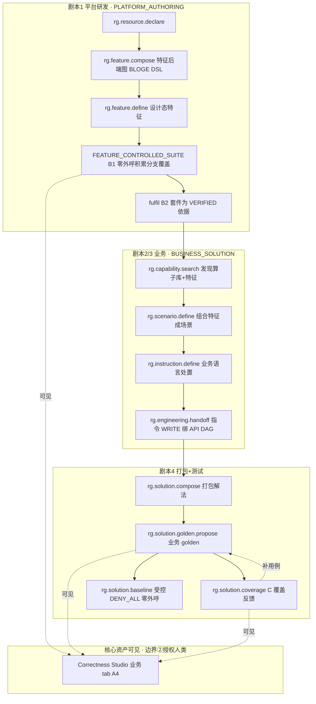

# Resource Gateway v1.4.7 详细技术方案
## 核心资产可见 · 端到端剧本贯通

> **文档性质**:自包含详细技术设计,供实施团队直接开发。阅读本文无需参与过任何前置设计讨论;所有系统概念、数据模型、接口、既有实现在首次出现处给出定义与文件位置。
> **范围**:`resource-gateway-examples` 工程的后端 Java(`solution`、`agenttdd`、`testing.correctness` 包)与前端 `src/main/frontend`。不改 BLOGE 图引擎、DSL 编译器内核、四实体语义。
> **不做**:重写既有加密存储;替换既有 fixture 目录;改动 v1.4.6 的 Agent 面零载荷契约。

---

## 1. 背景与目标

### 1.1 Resource Gateway 是什么

Resource Gateway(下称 RG)是一个 Spring Boot(Java 25)示例服务,把外部 HTTP API 编排成可被上层 AI Agent 调用的业务能力。RG 的产品主张:业务负责人不写代码、不画千节点流程图,而是用自然语言向 AI 编码代理(下称 Agent,当前实现为 Codex)表达业务意图,Agent 把意图编译成 RG 的**四实体声明式资产**,RG 保证这些资产可验证、可治理、可运营。

RG 对 Agent 暴露的接口是 **MCP 工具**(Model Context Protocol,一组带 JSON Schema 的命名工具,如 `rg.feature.define`、`rg.solution.compose`)。工具目录定义于 `McpToolCatalog.java`。

### 1.2 四实体纯函数架构(本文全程依赖,先行定义)

RG 把一个业务解法拆成四类互相解耦的纯声明式实体:

| 实体 | 定义 | 关键字段 | 是否图节点 |
|---|---|---|---|
| 特征 Feature | 一条类型化事实的**声明式采集契约**(只读、不决策、不处置) | `evaluationKind`(采集方式:API/DAG/MODEL/INSTRUCTION_RESULT/USER_COMPONENT/USER_CONVERSATION);`determinism`(DETERMINISTIC/NON_DETERMINISTIC/INTERACTIVE);`output`(值类型);`businessSemantics`(业务含义) | 否,是解法的输入参数 |
| 场景 Scenario | 一张**唯一命中决策表**(纯函数,输入一组特征值→出口) | `rules[]`(when 谓词→outlet);`otherwise`;`hitPolicy=UNIQUE`;出口种类 SUB_SCENARIO/INSTRUCTION/TERMINAL | 否,是纯决策 |
| 指令 Instruction | 一个**处置动作**(结果 + 推理必填;读或写) | `effect`(READ/WRITE);WRITE 需 `writeGovernance{downstreamSystem,reconciliationKey,adapterRef}`;`bindingRef`(实现绑定,缺席=设计态) | 否,是纯派发 |
| 解法 Solution | 把特征值经场景决策派发到指令的**纯函数图** | `inputs`(特征值映射);`rootScenarioRef`;`instructions[]`;`goldenRef`(验证集引用) | 是,纯 graph |

**架构基石**:解法是纯函数——输入是已求值的**特征值**,输出是处置。特征采集(调外部 API、问用户、跑 DAG)由 Agent 在图**之外**完成,RG 不碰交互与异步。这把"组合爆炸的命令式流程"降维成"线性可测的纯函数 + 声明式决策表"。

四实体契约类:`FeatureContract.java`、`ScenarioContract`、`InstructionContract`、`SolutionContract`(同包)。

### 1.3 特征后端与"零外呼"测试模型(先行定义)

一个特征的 `evaluationKind=DAG` 时,其**后端**是一张 API 资源编排图(用 BLOGE DSL 描述:`httpResource` 节点读外部 API,其它节点做转换/决策)。指令的 WRITE 实现同样是一张 API 资源图。

RG 已有一套**零外呼(zero-egress)测试**机制,让这些图在**不调用真实外部 API** 的前提下被验证:

- **fixture(测试替身数据)**:一条外部依赖的预置返回值,替代真实 API 响应。载荷加密存于**保险库(vault)**,只留元数据在目录。
- **依赖行为桩(dependency behavior)**:对图中某个节点声明 RETURN/ERROR/DELAY/TIMEOUT/REPLAY/OBSERVE/MUST_NOT_CALL,MCP 工具 `rg.scenario.setDependencyBehavior`。
- **模拟(simulate/rehearse)**:`rg.feature.rehearse`(fixture-only 零外呼)、`rg.simulate`、`rg.tool.baseline` 跑图并产出证据,`realExternalCalls=0` 是硬约束。

### 1.4 v1.4.7 目标

一句话:**让四类使用剧本端到端顺畅跑通,并把过程中积累的 fixture 测试数据与 golden 验证集作为可见、可累积的核心资产呈现给授权人类。**

具体目标:

1. **剧本贯通**:平台研发加工特征→业务发现能力→业务语言描述处置→打包解法+高覆盖模拟测试,四步无断点。
2. **资产可见**:授权人类经控制台看到已积累的 fixture 测试数据、golden 验证集内容(given/期望/依赖假设)、覆盖度。
3. **不破坏安全立场**:Agent 面维持零载荷(Agent 拿不到业务明文);人类可见走独立授权边界。

---

## 2. 要解决的问题

### 2.1 四类使用剧本(需求原型)

| 剧本 | 角色 | 意图 | 核心诉求 |
|---|---|---|---|
| 剧本1 | 平台研发 | 用 Agent 加工特征(后端=API 资源集成 + DAG 编排,天然 BLOGE DSL) | 接入特征后,**不依赖真实 API** 积累验证数据做**逻辑分支覆盖** |
| 剧本2 | 业务人员 | 经 Agent 对话筛选平台现有业务能力(算子库)与已有特征 | 据业务理解决定把哪些特征组合成"业务情况"(场景) |
| 剧本3 | 业务人员 | 用业务语言描述:不同组合条件下用怎样的处置方案执行怎样的业务动作 | 指令(=API 资源 DAG 组合)的业务语言声明 |
| 剧本4 | 平台研发/业务 | 整体打包为业务解决方案,用 Agent 建高覆盖测试用例 | 测试用例**不依赖真实 API 模拟执行** |

**贯穿诉求(用户第一优先级)**:剧本顺畅跑通 + 看到积累的 **fixture 测试数据**与 **golden 验证集**这两类核心资产。

### 2.2 现状盘点(已建能力,两套割裂的测试世界)

RG 现有两套彼此独立的测试/资产体系:

**世界一 · 遗留 Correctness Studio(服务 Tool/Graph 图)**——成熟且可见:

| 组件 | 职责 | 文件 |
|---|---|---|
| fixture 目录服务 | fixture 描述符生命周期 DRAFT→PROPOSED→APPROVED→ACTIVE | `FixtureCatalogService.java` |
| fixture 目录存储 | heads + revisions + 使用索引 + outbox | `DatabaseFixtureAssetRepository.java` |
| fixture 载荷保险库 | 加密读写 + 密级 + 保留期 + 访问审计 | `FixtureMaterialService.java` |
| 载荷传输边界 | no-store HTTP,授权读 | `FixtureMaterialController.java` |
| 覆盖度清单 | 覆盖义务(维度/风险/责任人) | 表 `rg_coverage_inventory_heads`、`rg_coverage_obligation_index`(V20260815_005) |
| 前端资产面 | fixture 目录 + oracle/assertion + 用例表 + **受保护载荷查看器** | `CorrectnessStudio.tsx`、`FixtureStudio.tsx` |

**世界二 · v1.4.6 四实体业务测试**——无人类可见面:

| 组件 | 职责 | 文件 |
|---|---|---|
| 业务 golden 服务 | 提议/列出业务 golden 案例(given 事实 + 依赖假设 + 期望结果) | `BusinessGoldenService.java` |
| 业务 golden 载荷存储 | 写入**同一** vault;失败即拒,绝不明文回退 | `BusinessGoldenMaterialStore.java` |
| 受控编译 | 冻结解法闭包→受控计划,egress=DENY_ALL | `BusinessFixtureCompiler.java` |
| 五面板业务看板 | 规则矩阵/处置清单/红绿板/特征卡/发布卡 | `BoardProjectionService.java` |
| 特征交接 | 设计态特征→工程绑求值后端→单 fixture 验证 | `FeatureHandoffService.java` |

### 2.3 缺口(带证据)

**G-VIS · 业务核心资产不可见(阻断剧本 2/4 的"看到")**
- v1.4.6 业务 golden 案例的 given/期望/依赖假设写入 vault,元数据存于 `agent_tdd` 的 CASE_SET(零载荷);唯一读出口 `rg.solution.golden.list` 只回摘要(计数/指纹/生命周期)。无任何人类控制台能浏览业务 golden 集内容。
- `BusinessGoldenMaterialStore.read` 仅供进程内(复核/受控测试)调用,无人类 HTTP 边界。
- 业务侧积累的 fixture(受控依赖假设、样本 fixture)不进世界一的 fixture 目录,不可浏览。

**G-VIS-2 · 看板红绿板与 vault 存储不匹配(既有缺陷)**
- `BoardProjectionService.redGreen()` 从 CASE_SET 行内读 `given`/`expect`(见其 `RedGreenView.CaseRow`),而 v1.4.6 已把 given/expect 移入 vault、行内置零载荷 → 看板案例行的 given/期望显示为空。

**G-VIS-3 · golden 载荷保留期与"持久资产"冲突(新暴露)**
- `FixtureMaterialService` 强制保留期 ≤ 365 天;`BusinessGoldenMaterialStore.write` 现固定 30 天(`RetentionDescriptor("rg.businessGolden.30d", 30, ...)`)。golden 验证集是用户要长期累积、长期可见的**核心资产**,30 天到期销毁载荷与此直接冲突。

**G1 · 两套测试世界未统一(阻断剧本 1)**
- `FeatureHandoffService.fulfil()` 只用**单条** `fixtureInputs` 跑一次 `backend.evaluate` + 单断言,即把特征置 VERIFIED,非覆盖式。
- 特征后端 DAG 的高覆盖零外呼验证只能走世界一(`rg.feature.rehearse` + `setDependencyBehavior` + fixture),其证据与四实体特征的 VERIFIED 状态**不打通**——积累的分支覆盖数据不构成特征"已验证"的依据。

**G-COV · 覆盖度对业务 golden 不可见(阻断剧本 4 的"高覆盖")**
- 世界一已有覆盖度清单(`rg_coverage_inventory`),但未接 v1.4.6 业务 golden;平台不告诉"决策表哪些规则/otherwise/依赖失败路径已被 golden 覆盖、还缺哪些"。高覆盖仅靠 Agent 自觉。

---

## 3. 解决这些问题创造的价值

| 价值 | 机理 | 受益角色 |
|---|---|---|
| 信任可挣得 | 业务负责人不盲信 AI 草案;看到 golden 验证集内容与红绿结果,逐条确认应然,信任逐案累积 | 业务负责人(用户) |
| 资产可累积 | fixture 数据与 golden 集成为可浏览、可长期保留的资产,跨解法/跨迭代复用;切换成本形成护城河复利 | 平台/组织 |
| 剧本无断点 | 平台研发的特征验证证据直接成为特征 VERIFIED 依据,业务侧复用时可信;四步贯通 | 平台研发 + 业务 |
| 高覆盖有保证 | 平台把未覆盖分支反馈给 Agent,覆盖从"自觉"变"可度量、可闭环" | 平台研发 + 质量 |
| 安全不妥协 | Agent 面零载荷维持;人类可见走独立授权 + 审计边界,合规立场不动摇 | 合规/安全 |

---

## 4. 解法设计

### 4.1 总体架构:两条信任边界 + 三条投影,复用既有资产面

**核心判断**:资产"看得到"与 v1.4.6"Agent 看不到"并非矛盾,而是**两条不同的信任边界**:

```
                        ┌───────────────────────────────┐
   Agent(Codex)  ──MCP──▶  RG 四实体 + 受控测试(零载荷) │  边界①:Agent 面
                        │  golden.list 仅回摘要/指纹       │  零载荷(维持不动)
                        └───────────────┬───────────────┘
                                        │ 同一加密 vault
                        ┌───────────────▼───────────────┐
   授权人类(业主/复核) ─HTTP no-store─▶ 业务资产控制台     │  边界②:人类面
                        │  授权 purpose + 密级 + 审计       │  授权可见(本方案新增)
                        │  解 vault 见 given/期望/依赖假设  │
                        └───────────────────────────────┘
```

边界②完全复用世界一既有机制:`FixtureMaterialService.read`(授权读)+ `FixtureMaterialController` 的 no-store 传输 + 访问审计。控制台复用 Correctness Studio 的目录 + 受保护载荷查看器组件。

三条投影把世界二的资产接入既有可见面:
- 投影 A:业务 golden 集 → 人类只读控制台 + 授权载荷查看器。
- 投影 B:特征后端受控测试证据 → 特征 VERIFIED 依据 + 可见资产。
- 投影 C:决策表覆盖义务 → 业务 golden 覆盖度反馈。

### 4.2 阶段 A · 业务资产控制台(可见性)

#### A0 保留期修正(前置,解 G-VIS-3)

业务 golden 载荷是**审定后的资产记录**,区别于短期 captured fixture。修改 `BusinessGoldenMaterialStore.write` 的保留策略:

| 项 | 现状 | 改为 |
|---|---|---|
| retention profile | `rg.businessGolden.30d` 固定 30 天 | `rg.businessGolden.lifecycle` 绑生命周期 |
| expiresAt | `now + 30d` | golden `DRAFT/PROPOSED` 期取上限 365 天;转 `ACTIVE` 时由治理路径**续期**(重写受保护记录,保留期滚动至下一上限);`RETIRED` 后进入 30 天宽限再到期 |
| 依据 | `FixtureMaterialService` 硬上限 365 天不变 | 用**续期**而非"一次性长保留"绕过 365 天硬约束,保持既有安全不变 |

续期入口:治理路径(golden 批准/发布签署)调 `BusinessGoldenMaterialStore.renew(receipt, identity)`,内部对同一 `fixtureAssetId` 以 `expectedRevision` 追加一版受保护记录、滚动 `expiresAt`。Agent 无此权限(purpose 门控)。

> 该项使 golden 验证集成为"只要 ACTIVE 就不销毁"的持久资产,直击用户"看到积累的 golden 验证集"诉求。

#### A1 业务 golden 集只读投影 + 授权载荷查看

**新增服务** `BusinessGoldenReviewService`(`solution/journey/` 包),职责:向授权人类投影业务 golden 集清单与单案例受保护内容,记录**人类归属**访问审计。

清单投影(无载荷)——复用 `BusinessGoldenService.list` 的摘要,补充人类视图字段:

```jsonc
// GET /api/solution/golden-review/{solutionRef}?journeyRef=...
{
  "solutionRef": "sol:cancel-dispute",
  "caseSetRef": "caseSet:journey:...",
  "revision": 7,
  "approvalState": "PENDING",          // 任一案例 ACTIVE 即 APPROVED
  "cases": [{
    "caseId": "G1",
    "businessIntent": "乘客在免费窗口内取消,应免除取消费",
    "lifecycle": "DRAFT",              // DRAFT/ACTIVE/DEPRECATED
    "qualityState": "DESIGNED_NOT_RUN",
    "factCount": 4, "assumptionCount": 2,
    "goldenCaseFingerprint": "sha256:...",
    "materialViewable": true           // 当前人类是否有权解载荷
  }]
}
```

单案例受保护内容(载荷,no-store)——授权人类解 vault:

```jsonc
// GET /api/solution/golden-review/{solutionRef}/cases/{caseId}/material
// 响应头:Cache-Control: no-store, private;Pragma: no-cache
{
  "caseId": "G1",
  "givenFacts": [                       // 解法输入特征值(应然前提)
    {"featureRef": "responsibility.party", "semantics": "取消费责任方", "value": "none"},
    {"featureRef": "cancel.withinFree",   "semantics": "是否免费窗口内", "value": true}
  ],
  "dependencyAssumptions": [            // 指令依赖的受控行为
    {"target": "全额免除取消费", "outcome": "SUCCEEDS_WITHOUT_EFFECT"}
  ],
  "expectedOutcome": {                  // 业务期望(应然结果 + 推理)
    "result": {"decision": "WAIVED"}, "reasoningClass": "免费窗口内取消"
  }
}
```

**授权与审计流程**(伪代码,`BusinessGoldenReviewService.readMaterial`):

```java
// 1. 人类身份 + 复核用途鉴权(非 Agent 用途)
identity.requireComplete();
require(IntegrationOperation.SOLUTION_GOLDEN_REVIEW.accepts(identity.purpose()));
// 2. 业务授权:该人类须为案例 oracleOwner 或持复核角色
requireReviewerOrOwner(scope, solutionRef, caseId, identity);
// 3. 取 CASE_SET 行 → materialReceipt
JsonNode receipt = caseRow(scope, caseSetRef, caseId).path("materialReceipt");
// 4. 解 vault(内部升 platform RESOLVE 身份,既有实现)
JsonNode payload = businessGoldenMaterialStore.read(receipt, identity);
// 5. 独立人类归属审计(补 vault 内部审计丢失的人类 actor)
reviewAudit.append(scope, caseSetRef, caseId, identity.actorId(),
                   "GOLDEN_MATERIAL_REVIEW", "ACCEPTED", identity.correlationId());
return projectHumanView(payload);   // 投影为 given/expected/assumptions
```

**新增传输边界** `BusinessGoldenReviewController`(仿 `FixtureMaterialController`):`@RequestMapping("/api/solution/golden-review")`,两端点(清单 READ / 载荷 no-store),`@ConditionalOnBean(BusinessGoldenReviewService.class)`。

**新增审计表** `rg_business_golden_review_audit`(仿 `rg_fixture_material_access_audit`):记录人类复核访问,列 `access_id, <scope 五列>, case_set_ref, case_id, actor_id, purpose, outcome, correlation_id, occurred_at`。

#### A2 业务 fixture 目录投影

平台研发/业务在受控测试中积累两类替身:依赖行为假设(`dependencyAssumptions`)与提供的样本 fixture(`rg.fixture.provide`)。把它们投影为可浏览目录。

**判断**:样本 fixture 已经过世界一 `FixtureCatalogService`(`rg.fixture.provide`/`rg.fixture.promote` 写入 `rg_fixture_asset_heads`),本就可见于 Correctness Studio 的 Fixtures 面板。缺的是**业务解法维度的归集视图**——按 solution/feature 列出其关联 fixture。

**新增只读投影** `BusinessFixtureIndexService.listForSolution(solutionRef)`:
- 从解法闭包(`BusinessFixtureCompiler` 已能冻结:solution→scenarios→features→instructions)取每个特征/指令的后端 `assetRef`。
- 用既有 `DatabaseFixtureAssetRepository.usages(...)`/`listHeads(...)` 反查这些 assetRef 关联的 fixture 描述符(名/变体/分级/生命周期/schema/被用计数)。
- 返回按"特征/指令 → 其 fixture 列表"归组的目录视图(纯元数据,载荷仍走 A1 式授权查看)。

无新存储;复用 `rg_fixture_asset_heads` + `rg_fixture_usage_index`。

#### A3 修红绿板 given/期望来源(解 G-VIS-2)

`BoardProjectionService.redGreen()` 现从 CASE_SET 行读 `given`/`expect`。改为:
- 行内保留零载荷(不回退)。
- 板上默认展示 `factCount`/`assumptionCount`/`expectedShapeFingerprint`(元数据,无明文)。
- 授权人类点开某案例时,前端调 A1 的 `/material` 端点按需解载荷填充该行 given/期望。

即红绿板默认零载荷、按需授权解密,与边界②一致。改动集中在 `redGreen()` 的 `CaseRow` 装配与前端点击加载。

#### A4 前端:Correctness Studio 增业务资产 tab

复用既有组件模式,新增两个面板:
- **Business Golden** 面板:列业务 golden 集(A1 清单),行点开经 `/material` 授权加载 given/期望/依赖假设,复用 `FixtureStudio` 的 "Load protected data"(`Eye` 图标 + `ProtectedKeyValueEditor` 只读态)。
- **Business Fixtures** 面板:A2 归集目录,行跳既有 fixture 载荷查看器。

前端 API 客户端仿 `correctnessAuthoringApi`(`fetchFixtureMaterial` 模式)新增 `fetchBusinessGoldenMaterial`。信息架构:Correctness Studio 顶部增"业务解法 / 遗留图"切换,两世界共用同一目录+查看器骨架。

### 4.3 阶段 B · 特征级受控测试统一(解 G1,支撑剧本 1)

#### B1 特征受控测试套件

目标:平台研发为一个特征(`evaluationKind=DAG`,后端=API 资源图)积累**高覆盖、零外呼**验证用例,存为可见资产。

**判断**:所需执行机制已存在于世界一——`rg.feature.rehearse`(fixture-only 零外呼跑特征后端)+ `rg.scenario.setDependencyBehavior`(逐节点桩)+ `rg.fixture.provide`(样本 fixture)。缺的是**把这些用例归集为"特征测试套件"这一命名资产**,并绑定到四实体特征。

**新增** `FeatureControlledSuiteService`(`solution/feature/` 包):
- 以特征 `featureRef` 为键,维护一个套件(存于 `agent_tdd` 新资产种类 `FEATURE_CONTROLLED_SUITE`)。
- 套件条目 = { caseId, givenInputs(特征后端图的输入), nodeBehaviors(逐节点桩,复用 `ScenarioDraftSet.DependencyBehaviorDraft` 模型), expectedOutput(特征输出契约的期望值), coverageTargets(命中的后端分支标识) }。
- `run(featureRef)`:对每条用例调既有零外呼执行(`rg.feature.rehearse` 路径),汇总 pass/fail + `realExternalCalls`(须为 0)+ 分支覆盖。
- 载荷(样本值/期望)入 vault(复用 `FixtureMaterialService`,授权可见)。

套件条目数据模型:

```jsonc
{
  "featureRef": "cancel.withinFree",
  "revision": 3,
  "cases": [{
    "caseId": "FB1",
    "intent": "创建时刻在免费窗口内 → true",
    "givenInputsRef": "material-receipt://...",   // 图输入,载荷入 vault
    "nodeBehaviors": [                              // 桩掉真实 API 节点
      {"nodeId": "order-api", "behavior": "RETURN", "valueRef": "material://..."}
    ],
    "expectedOutputRef": "material://...",          // 期望特征值
    "coverageTargets": ["branch:within-free-window"],
    "verdict": "PASS", "realExternalCalls": 0
  }],
  "coverage": {"branchesTotal": 4, "branchesCovered": 3}
}
```

#### B2 特征 VERIFIED 依据升级为"套件 + 覆盖阈值"

改 `FeatureHandoffService.fulfil`:

| 项 | 现状 | 改为 |
|---|---|---|
| VERIFIED 依据 | 单条 `fixtureInputs` 跑一次 `backend.evaluate` + 单断言 | 引用特征受控套件的**证据指纹** + 覆盖率达阈值 |
| 输入 | `evaluationRef, fixtureInputs` | `evaluationRef, suiteEvidenceRef`(套件运行证据) |
| 校验 | 输出匹配契约 | 套件全 PASS + `realExternalCalls=0` + `branchesCovered/branchesTotal ≥ 阈值`(默认可配,如 100% 关键分支) |
| 失败态 | 停在 IMPLEMENTED | 不变(证据不足停 IMPLEMENTED,工程补用例后重验) |

兼容:保留单 fixture 快路径作为"最小验证"过渡开关(灰度期),默认走套件依据。既有已发布特征迁移见 §7。

#### B3 剧本 1 端到端接线

平台研发在 `PLATFORM_AUTHORING` 面:`rg.resource.declare`(声明外部资源)→ `rg.feature.compose`(BLOGE DSL 写特征后端图)→ `rg.feature.define`(声明四实体特征,设计态)→ 建 `FEATURE_CONTROLLED_SUITE`(B1,零外呼积累分支覆盖)→ 工程 `fulfil`(B2,套件为 VERIFIED 依据)。全程 `realExternalCalls=0`,套件与 fixture 可见于控制台(A)。

### 4.4 阶段 C · 覆盖度可见(解 G-COV,支撑剧本 4)

#### C1 决策表覆盖义务派生 + golden 覆盖反馈

**判断**:覆盖度存储模型已存在(`rg_coverage_inventory_heads` + `rg_coverage_obligation_index`,字段含 `dimension/risk/owner/lifecycle/source`);决策场景枚举器已存在(`AgentTddDecisionScenarioEnumerator`,把决策表规则/阈值/枚举展开为代表用例)。缺的是把二者接到业务 golden。

**新增** `SolutionCoverageService.derive(solutionRef)`:
1. 取解法根场景决策表,用 `AgentTddDecisionScenarioEnumerator` 派生覆盖义务:
   - 每条规则(`rules[]`)→ 一条义务(dimension=RULE)。
   - `otherwise` → 一条义务(dimension=OTHERWISE)。
   - 每条指令的依赖失败路径(WRITE 指令的 UNAVAILABLE/FAILS_WITHOUT_EFFECT)→ 义务(dimension=DEPENDENCY_FAULT)。
2. 写入 `rg_coverage_inventory`(source=SOLUTION_DECISION)。
3. `SolutionCoverageService.status(solutionRef)`:遍历该解法业务 golden 集,按每案例命中的 `rulePath`/期望,标记义务 covered/uncovered;返回覆盖矩阵。

覆盖状态投影(控制台 + Agent 摘要):

```jsonc
// GET /api/solution/coverage/{solutionRef}
{
  "solutionRef": "sol:cancel-dispute",
  "obligations": [
    {"id": "rule:R1", "dimension": "RULE", "risk": "HIGH", "covered": true,  "byCaseIds": ["G1"]},
    {"id": "rule:R3", "dimension": "RULE", "risk": "HIGH", "covered": false, "byCaseIds": []},
    {"id": "otherwise", "dimension": "OTHERWISE", "risk": "MEDIUM", "covered": false, "byCaseIds": []},
    {"id": "fault:refund-service:UNAVAILABLE", "dimension": "DEPENDENCY_FAULT", "risk": "HIGH", "covered": false}
  ],
  "summary": {"total": 8, "covered": 3, "uncoveredHighRisk": 3}
}
```

#### C2 Agent 面覆盖引导(零载荷)

新增只读 MCP 工具 `rg.solution.coverage`(surface=BUSINESS_SOLUTION,impact=READ),回上述义务的**指纹/维度/风险/covered 布尔**(无业务明文),让 Agent 知道"还缺哪些用例"并据此提议新 golden(`rg.solution.golden.propose`),形成"提议→覆盖反馈→补提议"闭环。控制台(A4)同源呈现"已/未覆盖"给人类。

### 4.5 端到端数据流(四剧本贯通)



---

## 5. 设计解法时的决策因素与依据

每条决策给出候选、所选、依据与代价。

### D1 · 资产可见的信任边界

| 候选 | 说明 | 优 | 劣 |
|---|---|---|---|
| A 授权人类 no-store 查看器(**选**) | 复用 `FixtureMaterialService.read` + `FixtureMaterialController` 模式,人类授权 purpose + 密级 + 审计 + no-store | 复用成熟加密/审计;Agent 面零载荷不动;合规立场清晰 | 需补人类归属审计(vault 内部审计记平台 actor) |
| B 常开脱敏摘要 | 只回计数/指纹,永不解明文 | 最安全 | 不满足"看到 given/期望"诉求 |
| C Agent 也可见载荷 | 放开 Agent 面 | 剧本对 Agent 更省事 | 破坏 v1.4.6 零载荷根基,合规倒退 |

**依据**:用户诉求是"**让我(人类)看到**",非"让 Agent 看到";A 用既有边界满足人类可见且不动 Agent 立场。代价(人类归属审计)由 D6 解。

### D2 · 控制台选型

| 候选 | 优 | 劣 |
|---|---|---|
| A 扩 Correctness Studio(**选**) | 复用成熟 fixture 目录 + 受保护载荷查看器 + 覆盖清单;两世界共用骨架 | 需做"业务/遗留"信息架构切换 |
| B 新建独立业务控制台 | 业务语言纯净 | 重复造目录+查看器+审计;割裂 |
| C 扩五面板业务看板 | 贴业务语言 | 看板为解法审阅态,非资产目录态;缺 fixture 目录/查看器 |

**依据**:D3(存储复用)决定了查看器复用世界一;控制台随存储走 A 最省且一致。

### D3 · 两套 fixture 存储的处置

| 候选 | 优 | 劣 |
|---|---|---|
| A 桥接投影(**选**):golden 载荷复用世界一 vault,元数据留 `agent_tdd`,新增只读投影 + 归集视图 | 零迁移;既有加密/审计/生命周期直接用 | 双写一致性需内容寻址兜底(见 §7 遗留) |
| B 全量统一到世界一 fixture asset 表 | 单一存储模型 | 大迁移;风险高;打断 v1.4.6 已交付路径 |
| C 维持各自独立 | 不动代码 | 业务世界永不可见(不满足诉求) |

**依据**:`BusinessGoldenMaterialStore` 已写入世界一 vault(既成事实),元数据侧只读投影成本最低、风险最小。

### D4 · 特征 VERIFIED 依据

| 候选 | 优 | 劣 |
|---|---|---|
| A 单 fixture(现状) | 简单 | 非覆盖;剧本 1"分支覆盖"落空;验证证据弱 |
| B 受控套件 + 覆盖阈值(**选**) | 特征验证=高覆盖零外呼证据;剧本 1 闭环;证据可见可复用 | 提高交接门槛;既有特征需迁移 |
| C 真实集成 attest | 最强 | 需真实环境;违"零外呼";超本期范围 |

**依据**:剧本 1 明确要"不依赖真实 API 做逻辑分支覆盖";B 用既有零外呼机制把覆盖证据一等化。C 归后续 attest 分期。

### D5 · 覆盖义务派生

| 候选 | 优 | 劣 |
|---|---|---|
| A 复用 `rg_coverage_inventory` + 决策场景枚举器(**选**) | 复用既有覆盖模型与枚举算法;不造新模型 | 需把枚举器接到四实体决策表 |
| B 新建业务覆盖模型 | 贴业务语言 | 重复造存储+算法;与世界一分裂 |

**依据**:覆盖存储与枚举算法均已存在,接线成本远低于重建。

### D6 · 业务案例载荷访问的人类归属

| 候选 | 优 | 劣 |
|---|---|---|
| A 新增独立复核审计(**选**):`rg_business_golden_review_audit` 记人类 actor | 保留人类归属;不改 vault 内部升权 | 一次访问两条审计(vault 平台 actor + 复核人类 actor) |
| B 直接复用 vault 内部审计 | 少一张表 | vault 内部把身份升为 platform RESOLVE,审计记平台 actor,**丢失人类归属**,合规不可接受 |

**依据**:`BusinessGoldenMaterialStore.read` 内部构造 `platform(...RESOLVE...)` 身份访问 vault(既有实现),vault 审计因此记平台 actor;合规要求人类可追溯 → 必须在复核层独立记人类归属。

---

## 6. 工程实施计划

三阶段可并行启动,阶段内有序。

### 阶段 A · 业务资产控制台

| 任务 | 产物 | 依赖 |
|---|---|---|
| A0 保留期修正 | `BusinessGoldenMaterialStore.write` 保留策略改生命周期绑定;新增 `renew(...)`;治理路径(golden 批准/发布)接续期 | 无 |
| A1 只读投影 + 授权查看 | 新增 `BusinessGoldenReviewService` + `BusinessGoldenReviewController`(仿 `FixtureMaterialController`);新增 `IntegrationOperation.SOLUTION_GOLDEN_REVIEW`;新增审计表 `rg_business_golden_review_audit` + migration | A0 |
| A2 业务 fixture 归集 | 新增 `BusinessFixtureIndexService.listForSolution`(复用 `DatabaseFixtureAssetRepository.usages/listHeads` + `BusinessFixtureCompiler` 闭包冻结) | 无 |
| A3 红绿板修正 | `BoardProjectionService.redGreen` 改零载荷 + 按需授权解载荷 | A1 |
| A4 前端 | Correctness Studio 增 Business Golden / Business Fixtures 面板;`fetchBusinessGoldenMaterial` API;业务/遗留切换 | A1、A2 |

### 阶段 B · 特征级受控测试统一

| 任务 | 产物 | 依赖 |
|---|---|---|
| B1 特征套件 | 新增 `FeatureControlledSuiteService` + `FEATURE_CONTROLLED_SUITE` 资产种类;复用 `rg.feature.rehearse` 执行路径 + vault 载荷 | 无 |
| B2 VERIFIED 升级 | 改 `FeatureHandoffService.fulfil` 依据套件证据 + 覆盖阈值;灰度开关保留单 fixture 快路径 | B1 |
| B3 端到端接线 | 剧本 1 走查脚本(declare→compose→define→suite→fulfil,`realExternalCalls=0`) | B1、B2 |

### 阶段 C · 覆盖度可见

| 任务 | 产物 | 依赖 |
|---|---|---|
| C1 覆盖派生 | 新增 `SolutionCoverageService.derive/status`(接 `AgentTddDecisionScenarioEnumerator` + `rg_coverage_inventory`) | 无 |
| C2 覆盖工具/呈现 | 新增 MCP 工具 `rg.solution.coverage`(READ,零载荷);控制台覆盖面板 | C1、A4 |

### 阶段 D · 贯通与文档

| 任务 | 产物 | 依赖 |
|---|---|---|
| D1 端到端验证 | 四剧本贯通测试(平台→业务→打包→可见);断言两条边界(人类解载荷 / Agent 零载荷) | A、B、C |
| D2 文档 | `docs/rg-evolution-design-1.4.7.md` 落地(需切实施模式) | D1 |

### 落地文件汇总

**新增**
- `solution/journey/BusinessGoldenReviewService.java`、`solution/journey/BusinessGoldenReviewController.java`
- `solution/journey/BusinessFixtureIndexService.java`
- `solution/feature/FeatureControlledSuiteService.java`
- `solution/coverage/SolutionCoverageService.java`
- migration:`rg_business_golden_review_audit`
- 前端:Correctness Studio 业务面板组件 + `businessGoldenReviewApi.ts`

**修改**
- `BusinessGoldenMaterialStore.java`:保留期生命周期化 + `renew`
- `FeatureHandoffService.java`:`fulfil` 依据套件
- `BoardProjectionService.java`:`redGreen` 零载荷
- `McpToolCatalog.java`:增 `rg.solution.coverage`
- `McpSurfacePolicy`:覆盖工具归 BUSINESS_SOLUTION 面

**验证命令**:`mvn -f `pom.xml` clean verify`;前端 `npm test`(Correctness Studio 业务面板渲染 + no-store 头断言 + Agent 零载荷断言)。

---

## 7. 落地后遗留问题与预计解法

| 编号 | 落地后仍存/新暴露 | 预计解法 | 分期 |
|---|---|---|---|
| L1 | 业务 golden 载荷入 vault + 元数据入 `agent_tdd` **非同一事务**(跨数据源);material 先写、元数据后写,靠内容寻址 + 失败即拒兜底,存在孤儿 material(惰性、可回收) | 加"无孤儿 material / 无虚假元数据"对账任务 + 定期 GC;或引入 outbox 关联清理 | 1.4.7 收尾 |
| L2 | A0 续期把 golden 载荷长期留存,增大加密数据留存面与合规审查范围 | 明确 golden 载荷保留合规基线(密级=INTERNAL、访问全审计、RETIRED 宽限销毁);法务复核 | 1.4.7 前置确认 |
| L3 | B2 提高特征 VERIFIED 门槛,**既有已 VERIFIED 特征**无套件证据 | 灰度:既有特征标 `LEGACY_SINGLE_FIXTURE`,不追溯失效;下次改动或治理触发时要求补套件 | 1.4.7 灰度 |
| L4 | 覆盖义务对 **opaque 谓词 / 子场景递归 / combinatorial 爆炸** 的覆盖定义有边界(不可枚举时覆盖率不可判) | opaque→标 `UNPROVABLE` 义务需 authorSamples;子场景→有界递归展开(深度上限);combinatorial→封顶 fail-closed(复用枚举器既有上限) | 1.4.7 |
| L5 | 两世界前端信息架构合并后,遗留 Correctness 用户与业务用户**术语混用**风险 | 顶层世界切换 + 术语分层(业务面用"业务情况/处置/验证集",遗留面保留"图/节点/fixture") | 1.4.7 前端 |
| L6 | 业务 fixture 归集(A2)反查依赖 fixture usage 索引的**及时性**(outbox 异步) | 归集视图标"索引时间";必要时同步反查兜底 | 观察后定 |
| L7 | 覆盖反馈只覆盖**设计态** golden,与**运行时**真实命中分布(运营态)未合流 | 后续把运营命中分布(`OperationsInsight` 信号)叠加到覆盖矩阵,形成"设计覆盖 + 真实覆盖"双视图 | 1.4.8 |
| L8 | 人类复核载荷查看的**权限模型**(owner/reviewer/密级)本期取"oracleOwner 或复核角色 + 密级",细粒度(字段级脱敏、按域授权)未做 | 引入字段级 redaction 视图 + 按业务域的复核授权矩阵 | 1.4.8 |
