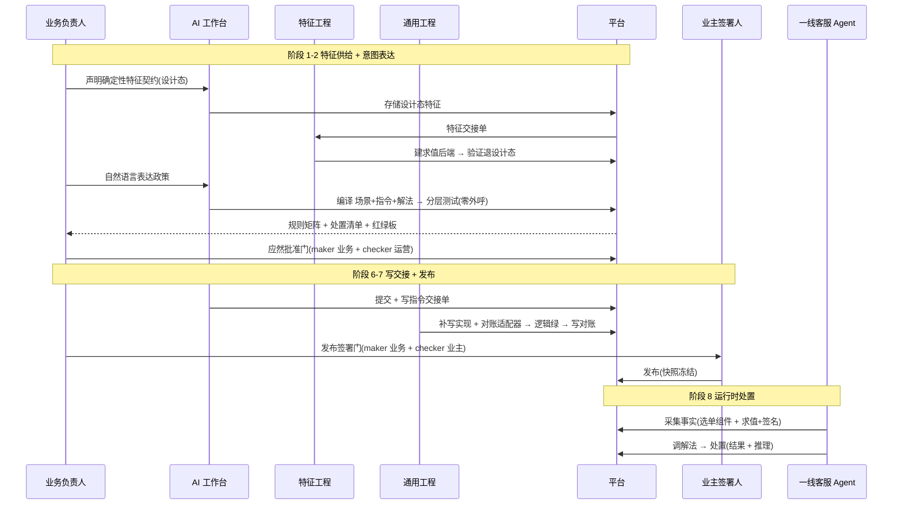
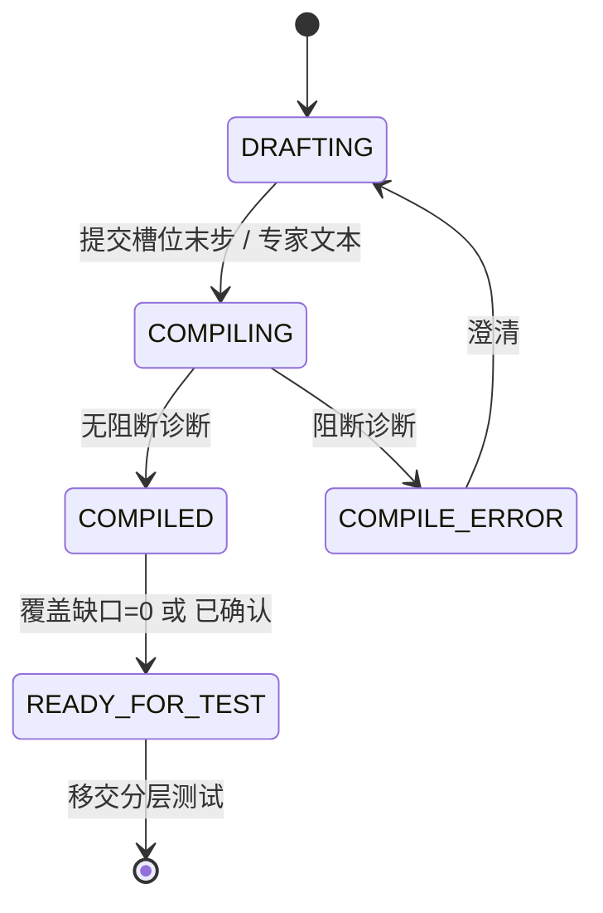

# 产品设计文档 v2:AI Native 声明式业务资产生产平台

**机制副标**:业务意图 → Agent 生产为声明式业务资产。
**目录**:1 目的读者 · 2 战略定位 · 3 战略摘要 · 4 理念与原则 · 5 核心资产模型 · 6 架构基石 · 7 角色权限 · 8 端到端旅程 · 9 阶段详设 · 10 信任与治理 · 11 领域模型验证走查 · 12 度量 · 13 验收 · 14 依赖风险 · 15 范围边界 · 16 实现映射 · 附录 A 技术契约(字段级)

## 1 目的与读者
- 目的:定义产品的通用工作流、各环节字段级信息流、支撑产品能力,供业务、产品、工程(特征工程与通用工程)、治理评审。
- 自包含声明:每个概念在首次出现处定义。全文无外部指引、无内部简写。
- 场景约定:取消费纠纷为验证场景(§11),非产品主线。

## 2 战略背景与定位
- 现状:业务团队用可视化画布逐节点绘制客服标准作业流程图,规模达数千节点,存储为 JSON 结构。
- 现状后果:图规模致审计困难;命令式结构致结构化调优困难;绘制致效率低;流程与取数/动作纠缠致验证困难。
- 命题:政策表达方式从"命令式流程图绘制"转为"声明式解法"。业务负责人用自然语言表达意图;AI 工作台把意图编译成结构化、可测试、可治理的业务资产。
- 范式类比:UI 从手写 DOM(命令式)到组件声明(声明式);基础设施从脚本(命令式)到声明式配置。业务编排为同类更替。
- 定位:业务编排的范式变革者。终结命令式画布,确立声明式解法。品类 = AI Native 声明式业务编排平台。首发领域 = 客服决策。

## 3 战略摘要

### 3.1 结构性收益(核心)
命令式画布的治理成本随流程路径组合爆炸;声明式分层把治理对象降为有限规则与处置,把正确性从"事后暴露"前移到"发布前证明"。
| 维度 | 命令式画布(现状) | 声明式解法(本产品) | 结构性收益 |
|---|---|---|---|
| 治理对象 | 数千节点的流程路径 | 有限规则矩阵 + 处置清单 | 治理复杂度 组合爆炸 → 线性(∝ 规则数) |
| 正确性 | 生产事故暴露 | 发布前 golden 逐条证明 | 质量 事后 → 事前 |
| 审计 | 追踪节点流转,难说清成因 | 规则命中路径 + 处置推理 + 签名事实 | 可审计 不可 → 可 |
| 变更 | 全图重验、排期发版 | 局部改规则/指令 + 局部回归 | 变更成本 全局 → 局部;周期 排期 → 当日 |
| 信任 | 靠"人写对了" | 事实签名 + 双人门 + 发布快照 | 信任 假设 → 机制 |
| 复用 | 节点复制 | 特征库 + 解法模板 | 边际成本 递增 → 递减 |

机制 → 收益链:声明式(P1 P3)→ 治理对象从路径降为规则 → 复杂度组合变线性;可测试性(P4)→ 每层钉值 + golden 回归 → 质量事后变事前;可验证行为(P3 P5 P7)→ 纯函数 + 推理 + 签名事实 → 行为可预验、可解释、可审计。

### 3.2 野心与护城河
- 野心:声明式业务编排平台;客服 beachhead;沿 decisioning 邻接扩张(风控/账务/履约/审批/准入/定价)。
- 护城河:① 声明式函数化地基(取数/决策/动作分离且纯,命令式画布无 retrofit 路径);② 可测可治(golden + 零外呼 + 对账,不可事后加);③ 信任运行时(事实签名 + 写受控 + 对账)。复利资产:特征库、golden 语料、运营数据、迁移锁定。

### 3.3 买家与扩张
- 用户 = 业务负责人;champion = CX 运营/政策负责人;经济买家 = CX VP/COO/合规(采购对象 = 风险↓、一致性↑、审计↑);看门人 = 工程(赋能:建特征后端 + 补写实现 + 守发布门)。
- 扩张:取消费纠纷 → 全 CX 决策处置 → CX 邻接 → 决策型业务品类。

### 3.4 产品级非目标
| 排除 | 依据 |
|---|---|
| 通用 BPM/工作流引擎 | 聚焦声明式决策 |
| 人机交互/异步编排入图 | 归调用方 Agent;解法 = 纯函数 |
| 通用可视化画布 | 可视化 = 只读审阅透镜 |
| 工单/CRM 替代 | 经指令 + 对账适配对接 |
| 功能宽度追逐 | 窗口期追复利资产 |

## 4 设计理念与指导原则
理念:业务负责人表达"要什么结果",平台保证"结果可验证、可治理、可运营"。执行细节归平台与工程。
| 编号 | 原则 | 定义 | 判据(可检验) | 反例 |
|---|---|---|---|---|
| P1 | 声明式呈现 | 呈现"什么规则、什么处置",非执行步骤 | 界面无流程连线,含规则矩阵与处置清单 | 节点连线画布 |
| P2 | 意图表达 | 业务输入 = 自然语言意图;业务不手写结构化规格 | 业务无代码、无结构化文本、无画布 | 业务编辑规则 JSON |
| P3 | 分层纯函数 | 特征取事实、场景做决策、指令做动作、解法做组合 | 决策不取数;取数不决策;动作不决策 | 一条规则混合取数+判断+写库 |
| P4 | 可测性即信任 | 草案经应然用例逐条验证后发布 | 发布前每条政策有绿色应然用例 | 未验证直接发布 |
| P5 | 事实可信 | 确定性事实由平台求值签名,调用方不可伪造;交互事实标来源 | 确定性事实带签名令牌,调用验签 | 调用方自填事实 |
| P6 | 契约优先 | 业务先声明契约,工程后补实现 | 业务产出设计态,工程履行交接单 | 业务等实现才能定义 |
| P7 | 处置可解释 | 处置输出结果+推理,推理必填 | 无推理处置被拒 | 仅返回结果码 |
| P8 | 写效应受控 | 真实写经受控通道+对账,调用方无写权 | 写指令模拟态桩掉,真实写独立授权+对账 | 调用方直接触发退款 |
| P9 | 双人双门 | 应然批准门+发布签署门,各 maker+checker | 两门各双人 | 单人自批自发 |
| P10 | 熟练度自适应 | 表意按熟练度切换:新手引导、专家主导 | 新手见结构化反问,专家见自由输入 | 单一交互强加全部用户 |

## 5 核心资产模型
| 资产 | 定义 | 输出 |
|---|---|---|
| 特征 Feature | 一条原子事实 + 取值方式契约(API / 计算图 / 模型 / 用户交互) | 类型化事实值 |
| 场景 Scenario | 对特征值的纯决策(唯一命中决策表 + 兜底) | 出口:子场景 \| 指令 \| 终结 |
| 指令 Instruction | 一次动作(读 \| 写) | 结果 + 推理 |
| 解法 Solution | 纯函数组合:特征值 → 场景决策 → 指令派发 | 处置(结果 + 推理) |

## 6 架构基石
| 基石 | 定义 | 后果 |
|---|---|---|
| 纯函数解法 | 解法与场景 = 纯函数(输入 = 特征值,输出 = 处置);无取数、无交互、无挂起 | 易测、零外呼、无 session/await |
| Agent 编排采集 | 调用方 Agent 采集特征(确定性 → 平台求值签名;交互 → 用户);平台图不碰交互/异步 | 交互复杂度移出平台 |
| 特征非图节点 | 特征 = 声明式采集契约 + 解法输入参数,不入解法图 | 求值路径异构(API/DAG/MODEL/交互)不污染图 |
| 内建算子 | scenarioCall(纯决策 + 子场景有界递归)、instructionCall(派发) | 解法编译为两算子纯函数图 |
| 子场景递归 | 场景出口 SUB_SCENARIO;scenarioCall 内递归;编译期无环检查 + 深度上限 | 分层决策树,避免组合爆炸 |

## 7 角色与权限
| 角色 | 定义 | 能做 | 不能做 |
|---|---|---|---|
| 业务负责人 | 客服政策 owner | 表意、审阅、应然批准(maker) | 写代码;触发真实写 |
| 特征工程 | 建确定性特征求值实现的工程角色 | 建求值后端、履行特征交接单 | 改政策规则 |
| 通用工程 | 建写指令实现的工程角色 | 补写实现、建对账适配器 | 改政策规则;经工具面操作 |
| 一线客服 Agent | 运行时自动化角色 | 采集事实、调解法 | 写执行;伪造事实 |
| 运营 | 表现监控角色 | 只读监控、应然批准(checker) | 创作、发布 |
| 业主签署人 | 发布责任人 | 发布签署(checker) | 创作 |

## 8 端到端用户旅程

## 9 阶段详设(字段级 + 支撑能力 + UX)

### 9.1 意图表达 — 表意工作台
关联原则:P2 意图表达、P10 熟练度自适应、P6 契约优先。

**输入契约 `IntentExpressionInput`**
| 字段 | 类型 | 来源 | 必填 | 说明 |
|---|---|---|---|---|
| sessionId | string | 系统 | 是 | 表意会话标识 |
| authorId | string | 鉴权 | 是 | 业务负责人标识 |
| proficiencyMode | enum{GUIDED,EXPERT} | 用户/推断 | 是 | 熟练度模式 |
| domainContext.availableFeatures[] | {name,fact,type,evaluationKind,determinism} | 平台 | 是 | 可引用特征 |
| domainContext.availableInstructions[] | {name,effect} | 平台 | 是 | 可引用指令 |
| domainContext.syntaxReference | object | 平台 | 是 | 四实体语法参考 |
| domainContext.contextFingerprint | string(sha256) | 平台 | 是 | 上下文指纹(漂移校验) |
| utterance | string | 用户(EXPERT) | 条件 | 自由文本政策 |
| slotResponses.decisionBasis[] | string | 用户(GUIDED) | 条件 | 决策依据描述 |
| slotResponses.decisionRules[] | {conditionText,dispositionText} | 用户(GUIDED) | 条件 | 判定规则描述 |
| slotResponses.dispositionActions[] | {actionText,downstreamText?} | 用户(GUIDED) | 条件 | 处置动作描述 |

**输出契约 `FourEntityDraft`**
| 字段 | 类型 | 说明 |
|---|---|---|
| draftId | string | 草案标识 |
| features[] | {name,fact,type,evaluationKind,determinism,state{DESIGN_ONLY\|READY}} | 特征草案 |
| scenario.inputs[] | featureRef | 决策输入特征 |
| scenario.rules[] | {ruleId,when:[{feature,op,value}],outletKind{INSTRUCTION\|SUB_SCENARIO\|TERMINAL},outletRef,bind:{target:source}} | 规则 |
| scenario.otherwise | {outletKind,outletRef,bind} | 兜底(必存在) |
| instructions[] | {name,effect{READ\|WRITE},resultSchema,reasoningRequired=true,writeGovernance?:{downstream,reconKey,adapterRef}} | 指令草案 |
| solution | {name,inputs:[featureRef]} | 解法草案 |
| diagnostics[] | {code,businessMessage,span} | 业务语言诊断(稳定码) |
| coverageGaps | {missingOtherwise,unboundInputs[],designOnlyFeatures[],designOnlyWrites[]} | 覆盖缺口 |
| contextFingerprint | string | 回带指纹 |

**处理规则(字段级)**
- GUIDED:三步槽位状态机,逐步产 `slotResponses` → 编译。
- EXPERT:`utterance` 单次编译 → `FourEntityDraft` + 差异清单。
- 约束:`scenario.rules[].when[].feature ∈ scenario.inputs`;`otherwise` 缺 → `coverageGaps.missingOtherwise=true`;写指令无 `writeGovernance` → 诊断码 `WRITE_GOVERNANCE_REQUIRED`。

**支撑能力 · 表意工作台** — 职责:承接自然语言意图,双模引导/编译,产 `FourEntityDraft`。边界:不测试、不发布。
布局(双栏)
| 区 | 组件 | 内容 |
|---|---|---|
| 左·输入 | 模式切换 | 引导 / 专家 |
| 左·引导 | 三步向导 + 步进器 | 决策依据 → 判定规则 → 处置动作;每步问答块 + Agent 追问气泡 |
| 左·专家 | 单文本域 + 提交 | 自由政策文本 |
| 右·预览 | 规则矩阵(只读) | 场景规则业务化 |
| 右·预览 | 处置清单(只读) | 指令结果 + 对账 |
| 右·预览 | 覆盖缺口提示 | 缺兜底 / 未绑定输入 / 设计态特征 / 设计态写 |

双模
| 模式 | 用户 | 输入形态 | 平台行为 |
|---|---|---|---|
| 引导 | 新手运营 | 三步槽位 | 逐步结构化提问 |
| 专家 | 专家业务人 | 单框自由文本 | 一次编译 + 差异回显 |

引导三步槽位、示例问句、反问触发
| 步 | 槽位 | 示例问句 | 反问触发 | 产出 |
|---|---|---|---|---|
| STEP_BASIS | 决策依据 | "判断退不退,依据哪些事实?" | 规则条件引用未声明依据 → "判断依据还缺 X 事实,补充?" | 特征引用 |
| STEP_RULES | 判定规则 | "责任方 none 且免责内,如何处置?" | 无兜底 → "其余情况如何处置?" | 场景规则 |
| STEP_ACTIONS | 处置动作 | "全额减免,写到哪个系统?" | 写动作无下游/对账 → "写到哪个系统?怎么核对?" | 指令 + 对账 |

草案状态机

交互契约(动作 → 响应)
| 用户动作 | 系统响应 |
|---|---|
| 切专家模式 | 隐向导、显单框、保留已收集槽位 |
| 提交槽位步 | Agent 追问 或 进下一步 |
| 提交专家文本 | 编译 → 右栏草案 + 差异清单 |
| 采纳/驳回差异项 | 更新 `FourEntityDraft` |
| 点"进入测试" | 校验 READY_FOR_TEST → 移交分层测试引擎 |

切换:显式开关 + 隐式(单框输入完整度阈值触发专家模式)。默认 = 引导模式。
约束:业务界面不含 DSL/结构化文本(P2);`instructions[].bindingRef` 恒空(P6);编译前校验 `contextFingerprint`,漂移 → 阻断重取。
边界用例:专家文本歧义 → 差异清单标"待澄清";引导中途切专家 → 已填槽位转专家文本预置。

### 9.2 特征供给 — 特征库 + 交接单 + 求值服务
关联原则:P3 分层、P5 事实可信、P6 契约优先。

**输入契约 `FeatureSupplyInput`** = {featureDraft, authorId, scopeKey}。
`FeatureDraft`(设计态)= {name, fact, output.type(枚举含列值/布尔/数值/字符串), evaluationKind{API,DAG,MODEL,USER_COMPONENT,USER_CONVERSATION}, determinism{DETERMINISTIC,NON_DETERMINISTIC,INTERACTIVE}, inputs{name:type}, evaluationRef?, state{DESIGN_ONLY,READY}}。
**输出契约 `FeatureHandoffTicket`** = {ticketId, featureName, requiredOutput, requiredInputs{name:type}, evaluationKind, businessSemantics, status{OPEN,IMPLEMENTED,VERIFIED}, acceptanceRef}。
**输出契约 `RegisteredFeature`** = {name, contractFingerprint, revision, state=READY, tokenCapability}。
**处理规则(字段级)**
- 声明:`evaluationRef` 空 → 注册设计态 + `FeatureHandoffTicket(OPEN)`。
- 履行:特征工程提交 `evaluationRef`(API 绑定/计算图名/模型版本)→ IMPLEMENTED。
- 验证:特征单测(fixture → 断言输出匹配 `output.type`)→ VERIFIED → `state=READY`。
- 交互特征(USER_*):无求值后端;state=READY;tokenCapability=false。

**支撑能力**
| 能力 | 职责 | 接口/界面 | 数据模型 | 约束 |
|---|---|---|---|---|
| 特征库 | 注册、检索、复用计数 | 检索(scope,name)→RegisteredFeature | 键(scopeKey,name);版本化;复用计数=解法引用数 | 退设计态前不可运行时调用 |
| 特征交接单 | 契约到实现衔接 | 特征工程待办 + 提交 evaluationRef + 验证结果 | 状态机 OPEN→IMPLEMENTED→VERIFIED | maker=业务,履行=特征工程 |
| 求值服务 | 确定性特征求值 + 令牌签发 | evaluate(featureRef,inputs,scope)→{value,token} | 令牌=签(名+输入指纹+值指纹+范围+时戳) | 交互特征拒绝(USE_NATIVE_INTERACTION) |

协同协议(特征,契约优先):设计态契约(事实名/类型/求值输入)→ 交接单 → 求值后端(API 或计算图)→ 退设计态条件(求值可用 + 输出类型匹配)。
边界用例:输出类型不匹配 → 回 IMPLEMENTED;模型特征版本变 → 契约指纹变 → 相关应然失效。

### 9.3 编译预检 — 编译器 + 预检服务
关联原则:P3 分层纯函数、P1 声明式呈现(诊断业务语言)。

**输入契约 `CompilePrecheckInput`** = {draft, contextFingerprint}。
**输出契约 `CompiledAsset`** = {assetId, solutionGraph, scenarioSpec, instructionSpecs[], precheckStages[{phase,status,diagnostics}], technicalAcceptance{ACCEPTED,REJECTED}, receiptFingerprint}。
**七阶段处理(字段级)**
| 阶段 | 校验 | 失败码 |
|---|---|---|
| CONTEXT | contextFingerprint 一致 | CONTEXT_DRIFT |
| PARSE | 草案结构合法 | PARSE_ERROR |
| RESOLVE | features/instructions 在 scope 可解析 | REFERENCE_UNRESOLVED(不泄名) |
| TYPE_CHECK | `when[].value` 匹配 `feature.output.type`;bind 目标匹配 | TYPE_MISMATCH |
| PURITY | 场景/解法无取数/写副作用节点 | PURITY_VIOLATION |
| SEMANTIC | 唯一命中可判定;otherwise 存在 | HIT_AMBIGUOUS / OTHERWISE_MISSING |
| ROUND_TRIP | 产物回投影等价 | ROUND_TRIP_MISMATCH |

**支撑能力**
| 能力 | 职责 | 算法/接口 | 约束 |
|---|---|---|---|
| 编译器 | 草案→CompiledAsset | 场景规则降唯一命中决策表;解法降两算子纯函数图(decide 场景调用→dispatch 指令派发) | 产物含且仅含 2 语义节点 |
| 预检服务 | 七阶段校验 + 稳定码诊断 | 诊断={code,businessMessage,span};业务语言化 | 任一 FAIL→REJECTED;不透传异常文本 |

边界用例:上下文漂移 → CONTEXT FAIL;设计态特征引用 → RESOLVE PASS 且标 designOnly(限模拟)。

### 9.4 分层测试 — 分层测试引擎 + 审阅看板·红绿板
关联原则:P4 可测性、P7 可解释。

**输入契约 `LayeredTestInput`** = {compiledAsset, goldenCases[GoldenCase], stubs{featureName:value, writeInstruction:stubResult}, side{RED,GREEN}}。
`GoldenCase` = {caseId, givenFacts{featureName:value}, expectedDisposition{instruction,result}, lifecycle{DESIGNED,ACTIVE}}。
**输出契约 `LayeredTestResult`** = {goldenSetId, byLayer.{feature,scenario,solution}{pass,fail}, cases[{caseId,verdict{PASS\|FAIL},hitRuleId,actualDisposition}], businessBacklog[{caseId,reason,owner}], realExternalCalls=0}。
**处理规则(字段级)**
- 特征层:givenFacts 直供 → 断言特征值(交互/模型特征照值测)。
- 场景层:givenFacts → 断言命中 ruleId + 出口。
- 解法层:givenFacts → 跑纯函数 → 断言 expectedDisposition;写指令 side=RED 桩、side=GREEN 沙箱绑定;realExternalCalls=0。
- FAIL → businessBacklog。

**支撑能力**
| 能力 | 职责 | 算法/界面 | 约束 |
|---|---|---|---|
| 分层测试引擎 | 三层零外呼执行 | 特征值断言 → 场景命中断言 → 解法处置断言;goldenSetId=契约+用例指纹 | realExternalCalls≠0 → 判无效 |
| 审阅看板·红绿板 | 业务语言呈现分层结果 + 待办 | 分层红绿条 + 逐例(事实/期望/实际/红绿)+ 待办列表;无 DSL | side=GREEN 前置=写指令已绑定 |

边界用例:模型特征非确定 → 值锚定采样;红项阻断应然批准门。

### 9.5 应然批准门 — 审阅看板·验证板 + 批准治理
关联原则:P4 可测性即信任、P9 双人双门。

**输入契约 `GoldenApprovalInput`** = {goldenSetId, cases[GoldenCase], makerId, checkerId}。
**输出契约 `ApprovedGoldenBaseline`** = {goldenSetId, approvalState{APPROVED,REJECTED}, makerSignature{actorId,timestamp}, checkerSignature{actorId,timestamp}, approvedCaseIds[]}。
**处理规则(双人制)**:maker 业务逐条标应然 → checker 运营复核;要求 goldenSetId 同、makerId≠checkerId、全 ACTIVE 用例绿;驳回 → 回阶段 9.1/9.4。
**支撑能力**
| 能力 | 职责 | 界面/规则 | 约束 |
|---|---|---|---|
| 审阅看板·验证板 | 应然逐条呈现 + 双人批准 | 用例卡(事实/期望/红绿)+ maker 勾选 + checker 复核 + 提交 | 无 DSL |
| 批准治理 | 双人制 + goldenSetId 绑定 | makerId≠checkerId;goldenSetId 漂移使批准失效 | 内容变更 → 失效重批 |

边界用例:批准后草案变更 → goldenSetId 变 → 批准失效。

### 9.6 写效应交接 — 写交接单 + 受控写 + 对账适配器
关联原则:P6 契约优先、P8 写受控。

**输入契约 `WriteHandoffInput`** = {solutionRef, designOnlyWrites[InstructionSpec], approvedGoldenBaseline, authorId}。
`InstructionSpec`(设计态写)= {name, resultSchema, reasoningRequired=true, writeGovernance{downstream, reconKey, adapterRef}, bindingRef=null}。
**输出契约 `WriteHandoffTicket`** = {ticketId, solutionRef, items[{instructionName,resultSchema,downstream,reconKey,adapterRef,businessIntent,acceptanceGolden}], status{OPEN,IMPLEMENTED,CLOSED}}。
**输出契约 `WriteReconciliation`** = {reconciliationId, solutionRef, goldenSetId, implementationFingerprint, environmentId=sandbox, status{RECONCILED,MISMATCH,RECOVERY_REQUIRED}, cases[{caseId,instruction,expectedFingerprint,observedFingerprint,match}]}。
**处理规则(字段级)**
- 聚合:solution 内 effect=WRITE 且 bindingRef 空 → items → `WriteHandoffTicket(OPEN)`。
- 履行:通用工程补 bindingRef + 建对账适配器 → IMPLEMENTED。
- 逻辑绿:分层测试 side=GREEN 通过(绑定齐、纯逻辑达标、零外呼)。
- 受控写(独立授权;业务与 Agent 无权):沙箱;崩溃安全预留;逐应然用例真实写 → 对账适配器回读 → RECONCILED/MISMATCH;进程丢失 → RECOVERY_REQUIRED(无自动重试)。

**支撑能力**
| 能力 | 职责 | 接口/算法 | 约束 |
|---|---|---|---|
| 写交接单 | 聚合设计态写 → 交接 | 状态机 OPEN→IMPLEMENTED→CLOSED;通用工程待办 + 提交 bindingRef+adapterRef | 影响级=提案;不授写执行权 |
| 受控写执行 | 沙箱真实写 + 崩溃安全 | 预留幂等键;IN_PROGRESS→RECOVERY_REQUIRED;COMPLETED→回放 | 独立授权;生产失败关闭 |
| 对账适配器 | 每下游一个;回读下游 → 结构化 observed | observe(reconKeyValue,caseInputs)→{reconKey,effect} | 不记录输入/凭证;载荷零泄漏 |

协同协议(写,契约优先):设计态契约(结果/下游/对账键/应然)→ 交接单 → 写实现绑定 + 对账适配器 → 退设计态条件(绑定就绪 + 逻辑绿 + 写对账)。
边界用例:expected≠observed → MISMATCH,不销账;实现指纹漂移 → 对账失效。

### 9.7 发布签署门 — 发布治理 + 审阅看板·发布卡
关联原则:P9 双人双门。

**输入契约 `PublishInput`** = {solutionRef, readiness{logicGreen,writeReconciled,ownerSignoff}, makerId, checkerId, signoffRef}。
**输出契约 `Publication`** = {publicationId, solutionSnapshot{scenarioSpec,instructionSpecs,solutionGraph}, contractFingerprint, implementationFingerprint, goldenSetId, makerSignature, checkerSignature, publishedAt}。
**处理规则(字段级)**:门 = logicGreen(9.4 side=GREEN 通过)∧ writeReconciled(9.6 RECONCILED 且指纹匹配)∧ ownerSignoff;commit(maker 业务)→ publish(checker 业主)→ 快照冻结契约+实现指纹;指纹漂移 → 就绪回落,签署失效。
**支撑能力**
| 能力 | 职责 | 规则 | 约束 |
|---|---|---|---|
| 发布治理 | 就绪门 + 双人签署 + 快照冻结 | 门=logicGreen∧writeReconciled∧ownerSignoff;makerId≠checkerId | 快照冻结契约与实现同一版本 |
| 审阅看板·发布卡 | 呈现就绪三门 + 签署 | 逻辑绿 / 写对账 / 签署状态 + 签署按钮 | 无 DSL |

边界用例:签署后修订 → 快照不变(运行时用快照);并行创作不影响已发布快照。

### 9.8 运行时处置 — 运行时求值 + 解法调用 + 受控写
关联原则:P5 事实可信、P7 可解释、P8 写受控。

**输入契约 `RuntimeInvokeInput`** = {solutionRef, suppliedFacts{featureName:FactEnvelope}, idempotencyKey, callerIdentity{scope,actorType,purpose=EXECUTION}}。
`FactEnvelope` = {value, source{PLATFORM,USER}, evaluationToken?(确定性必填), evaluationInputs?(确定性必填,验签绑定)}。
**输出契约 `Disposition`** = {result, reasoning(必填), instructionRef, rulePath[], publicationId, executionStatus{COMPLETED,RECOVERY_REQUIRED}}。
**处理规则(字段级)**
- 采集(调用方 Agent,图外):交互特征 → 选单组件(source=USER);确定性特征 → 求值服务 → {value,token}(source=PLATFORM)。
- 验签:确定性事实逐个校验(token 绑定 name+输入指纹+值指纹+scope+TTL);交互事实要求 source=USER;缺 token 的确定性 → FEATURE_TOKEN_INVALID。
- 调解法:取已发布快照(published-only;未发布 → SOLUTION_NOT_PUBLISHED)→ 纯函数(场景决策 → 指令派发)。
- 写受控:命中写指令 → 内部派生写执行授权(调用方无权)→ 受控写 + 幂等(idempotencyKey)。

**支撑能力**
| 能力 | 职责 | 接口 | 约束 |
|---|---|---|---|
| 运行时求值 | 确定性特征求值 + 签名 | evaluate(featureRef,inputs,scope)→{value,token} | 交互特征拒绝 |
| 解法调用 | published-only 纯函数 + 验签 + 幂等 | invoke(solutionRef,suppliedFacts,idempotencyKey);快照冻结执行 | 未发布拒绝;崩溃安全 |
| 受控写 | 命中写指令的受控执行 | 内部派生写授权;调用方无写权 | 幂等;歧义→RECOVERY_REQUIRED |

边界用例:令牌篡改 → 拒且不派发;重放 idempotencyKey → 回放同结果;交互事实冒充 PLATFORM → 拒绝。

### 9.9 运营回流 — 运营看板(可运营闭环;首发不含)
**输入契约 `OperationsSignalInput`** = {solutionRef, window, dispositions[{rulePath,instructionRef,result}]}。
**输出契约 `OperationsInsight`** = {hitDistribution[{ruleId,share}], escalationRate, dispositionDistribution[{result,share}], redGolden[{caseId}], policyGaps[{ruleId,symptom,suggestedRevision}]}。
**处理规则**:聚合处置 → 命中/升级/处置分布;红应然=当前失败用例;高升级 ruleId + 红应然 → 建议修订 → 触发阶段 9.1。
**支撑能力**:运营看板(分布 + 升级率 + 红应然 + 缺口→修订待办;载荷零泄漏)。
边界用例:样本不足 → 分布置信标注;红应然 → 高亮驱动修订。

## 10 信任与治理(横切汇总)
关联原则:P4 可测性、P5 事实可信、P8 写受控、P9 双人双门。
| 机制 | 具体 |
|---|---|
| 事实签名 | 平台求值确定性特征后,对"特征名+输入指纹+值指纹+范围+时间戳"签短期令牌(有效 300 秒);调用解法时逐事实验签 |
| 交互事实 | 用户选单产生;标记来源=用户;免令牌 |
| 应然批准门 | 应然用例逐条批准;maker 业务 + checker 运营 |
| 发布签署门 | maker 业务提交 + checker 业主签署;发布快照冻结契约与实现 |
| 漂移失效 | 发布后实现指纹变更 → 对账与签署失效 |
| 零外呼验证 | 分层测试写指令桩掉;真实外呼计数 = 0 |
| 写受控 | 真实写经独立授权通道 + 下游回读对账;调用方无写执行权限 |

## 11 领域模型验证走查:取消费纠纷
用途:实例化工作流一次,验证信息流闭合与产品支撑。非主线。首发收敛:确定性特征 2、交互特征 1、指令 3;恶意信号特征与司机责任子场景移入后续范围。
**特征清单**(P3 分层、P5 事实可信)
| 特征名 | 事实 | 类型 | 来源方式 | 求值输入 | 信任 |
|---|---|---|---|---|---|
| responsibility.party | 责任方 | 枚举[passenger/driver/platform/none] | 后端 API | orderId | 平台签名 |
| cancel.withinFree | 免责时长内 | 布尔 | 后端计算图 | orderId | 平台签名 |
| dispute.orderSelected | 争议订单标识 | 字符串(orderId) | 用户选单组件 | — | 来源=用户 |

**决策规则矩阵**(唯一命中 + 兜底)
| 规则 | 责任方 | 免责内 | 处置 |
|---|---|---|---|
| 规则1 | none | 是 | 全额减免 refund-waive-full |
| 规则2 | none | 否 | 维持 uphold |
| 规则3 | passenger | 任意 | 维持 uphold |
| 规则4 | driver | 任意 | 升级人工 escalate-human-ticket |
| 兜底 | 其余 | | 升级人工 escalate-human-ticket |

**处置指令**(P7 可解释、P8 写受控)
| 指令 | 效应 | 结果字段 | 推理 | 下游系统 | 对账键 |
|---|---|---|---|---|---|
| refund-waive-full | 写 | decision=WAIVED, waiveAmount | 必填 | refund-service | orderId |
| escalate-human-ticket | 写 | ticketId | 必填 | ticket-service | orderId |
| uphold | 读 | decision=UPHELD | 必填 | — | — |

**解法** sol:cancel-dispute;输入事实 = {responsibility.party, cancel.withinFree, dispute.orderSelected 的 orderId};减免金额由退款指令下游读取。
**走查结论**:各阶段信息流闭合(意图→草案→资产→应然→发布物→事实→处置),产品能力覆盖。

## 12 度量
| 信号 | 口径/公式 | 埋点 |
|---|---|---|
| 政策变更周期 | 发布签署时刻 − 表意起始时刻 | 表意起点、发布门 |
| 独立创作率 | 无工程介入完成草案负责人数 / 总数 | 表意会话 |
| 无结构化文本批准率 | 未查看结构化文本的批准数 / 总批准数 | 应然批准门 |
| 应然用例累积 | 批准应然用例条数 | 验证板 |
| 特征复用 | 特征被解法引用次数 | 解法编译 |
| 升级率 | 升级人工处置数 / 总处置数 | 运行时 |

## 13 验收标准
| 项 | 门槛 |
|---|---|
| 端到端 | 全新 AI 工作台按业务提示词完成四阶段 |
| 独立创作 | 业务负责人独立产出取消费纠纷草案 |
| 无 DSL 批准 | 业务凭红绿应然用例批准发布,无结构化文本阅读 |
| 零外呼 | 分层测试真实外呼计数 = 0 |
| 事实可信 | 令牌篡改 → 调用拒绝 |
| 写对账 | 受控写执行对账状态 = 已对账 |
| 构建 | `mvn -f `pom.xml` clean verify` 通过 |

## 14 依赖与风险
| 类别 | 项 | 应对 |
|---|---|---|
| 依赖 | party/withinFree 求值后端、选单组件、退款/工单对账适配器 | 特征工程与通用工程按交接单履行 |
| 依赖 | 特征交接工具、表意工作台双模、审阅看板 | 首发建设 |
| 风险 | AI 草案准确度 | 分层测试 + 应然用例逐条拦截(P4) |
| 风险 | 业务对 AI 草案信任建立 | 逐条应然验证 + 业务语言呈现(P4、P1) |
| 风险 | 双模交互复杂度 | 首发引导模式优先,专家模式次之 |

## 15 范围边界
| 首发含 | 首发不含 |
|---|---|
| 取消费纠纷单场景;特征供给;解法定义;写交接与发布;运行时处置 | 运营回流闭环;存量图迁移;多解法降级链;客服全域;恶意信号 + 司机责任子场景;交互组件标准化库 |

## 16 实现映射(已建 vs 新建)
工程无需从零;核心引擎约 70% 已实现。
**已建(复用)**:四实体契约解码/注册(SolutionAuthoringDecoder/SolutionEntityRegistry)· 编译 lowering(SolutionLowering→2 算子图)+ 七阶段预检(DslImportService)· scenarioCall/instructionCall 算子 · 分层测试+golden(SolutionTestingService)· 信任令牌(FeatureValueTokenService)+ 验签接入(SolutionInvocationService)· 写治理(EngineeringHandoffService/SolutionWriteExecutionRunner/ReconciliationAdapter)· 发布治理(SolutionGovernanceService,快照+漂移失效)· 运行时(SolutionLiveInvocationService,published-only+内部派生写授权+崩溃安全)· MCP 工具面(ResourceGatewayAgentTddTools)。
**已建(1.4.5 Q1)**:特征交接工具 `rg.feature.handoff` · 独立 `AGENT_TDD_FEATURE_ENG` 履行端点 · OPEN→IMPLEMENTED→VERIFIED 状态机 · 受控样例输出类型校验。

**待建(增量)**:表意工作台(双模自适应+熟练度推断,FE)· 审阅看板(业务语言呈现,FE)· 交互特征标准化(选单组件契约+对话协议)· 运营看板+数据回流 · 场景求值后端(party/withinFree)+ 对账适配器(refund/ticket)。

## 附录 A 技术契约(字段级)

### A.1 API 契约(MCP 工具面)
共享请求信封:Header `Authorization: Bearer <token>` · `X-Purpose: <purpose>` · `X-Idempotency-Key`(mutation);Body 工具参数。
共享响应:成功 `{ok:true,data,diagnostics[{code,message,severity}]}`;失败 `{ok:false,error{code,message,retryable},diagnostics[]}`。
| 工具 | 门 | 输入 | 输出 |
|---|---|---|---|
| rg.feature.define | AUTHORING | {featureYaml, idempotencyKey} | {featureId, evaluationKind, determinism, speccing, revision, contractFingerprint} |
| rg.feature.handoff | AUTHORING | {featureRef, idempotencyKey} | {ticketId, featureName, requiredOutput, requiredInputs, status, acceptanceRef} |
| rg.feature.evaluate | EXECUTION | {featureRef, inputs} | {featureRef, value, evaluationToken, evaluationKind}(交互→USE_NATIVE_INTERACTION) |
| rg.scenario.define | AUTHORING | {scenarioYaml, libraryRefs[], idempotencyKey} | {scenarioId, ruleMatrix, tree{acyclic,maxDepth,referencedScenarios[],referencedInstructions[]}, revision, contractFingerprint} |
| rg.instruction.define | AUTHORING | {instructionYaml, idempotencyKey} | {instructionId, effect, reasoningRequired, writeGovernance?, speccing, revision, contractFingerprint} |
| rg.solution.compose | AUTHORING | {solutionYaml, authoringContextFingerprint, idempotencyKey} | {solutionRef, inputContract, scenarioTreeValid, precompiled, graphNodeCount, pureFunctionProjection, speccing, authoringReceiptFingerprint, revision, contractFingerprint} |
| rg.solution.getContract | READ | {solutionRef} | {solutionRef, problem, inputs[{name,featureRef,evaluationKind,determinism,evaluationInputs,output}], outputContract} |
| rg.scenario.test | EXECUTION | {scenarioRef, cases[{givenFacts,expectedOutlet}]} | {byCase[{caseId,hitRuleId,outlet,pass}], realExternalCalls:0} |
| rg.solution.baseline | EXECUTION | {solutionRef, caseSetRef, side} | {goldenSetId, byLayer, cases[], businessBacklog[], realExternalCalls:0} |
| rg.solution.commit | AUTHORING→PROPOSE | {solutionRef, authoringReceiptFingerprint, idempotencyKey} | {proposalFingerprint, status} |
| rg.engineering.handoff | PROPOSE | {solutionRef, idempotencyKey} | {handoffId, status, items[]} |
| rg.solution.readiness | READ | {solutionRef} | {state, publishable, gates{logicGreen,implementationBound,writeReconciled,ownerSignoff}, remainingLimitations[], goldenSetId, evidenceFingerprint, implementationFingerprint, solutionRevision} |
| rg.solution.publish | GOVERNANCE | {solutionRef, signoffRef, idempotencyKey} | {publicationId} |
| rg.solution.invoke | EXECUTION(运行时) | {solutionRef, inputs{featureName:{value,source,evaluationToken?,inputs?}}, idempotencyKey} | {result, reasoning, instructionRef, rulePath[], publicationId, executionStatus, verifiedFeatureCount} |
| rg.solution.performance | READ | {solutionRef} | {hitDistribution[], escalationRate, dispositionDistribution[], redGolden[]} |

错误码目录:`SCHEMA_NONCONFORMANT` · `COMPILE_ERROR` · `REFERENCE_UNRESOLVED` · `CONTEXT_DRIFT` · `TYPE_MISMATCH` · `PURITY_VIOLATION` · `HIT_AMBIGUOUS` · `OTHERWISE_MISSING` · `ROUND_TRIP_MISMATCH` · `SCENARIO_TREE_CYCLE` · `SCENARIO_TREE_TOO_DEEP` · `SCENARIO_BIND_INCOMPLETE` · `SCENARIO_OUTLET_UNRESOLVED` · `WRITE_GOVERNANCE_REQUIRED` · `FEATURE_TOKEN_INVALID` · `USE_NATIVE_INTERACTION` · `FEATURE_BINDING_REQUIRED` · `SOLUTION_NOT_PUBLISHED` · `SOLUTION_INPUT_INVALID` · `GATE_REJECTED` · `FORBIDDEN_PURPOSE` · `GREEN_BASELINE_ABSENT` · `WRITE_EXECUTION_NOT_RECONCILED` · `INSTRUCTION_OUTPUT_INVALID` · `SOLUTION_INVOCATION_RECOVERY_REQUIRED`

### A.2 持久化模型
**agent_asset**:id(PK)· scope_key(idx)· asset_kind(FEATURE/SCENARIO/INSTRUCTION/SOLUTION/GOLDEN_CASE_SET/HANDOFF/FEATURE_HANDOFF/RECONCILIATION/PUBLICATION/EVIDENCE/PROPOSAL/SIGNOFF)· asset_ref(idx)· revision · contract_fingerprint · state · state_json(jsonb)· created_at/updated_at · unique(scope_key,asset_kind,asset_ref,revision);当前=max(revision)。
**idempotency**:scope_key/operation/idempotency_key(unique)· request_fingerprint · response_json · status{IN_PROGRESS,COMPLETED}。
**external_execution**:scope_key/operation/reservation_key(unique)· request_fingerprint · status{IN_PROGRESS,COMPLETED}· response_json · created_at/completed_at。

### A.3 鉴权与多租户
身份:{tenantId, organizationId, projectId, environmentId, region, actorType{HUMAN,WORKLOAD,PLATFORM}, actorId, purpose, correlationId};scopeKey = join(五元组,"|")。
| purpose | 允许操作 |
|---|---|
| AGENT_TDD_AUTHORING | define / compose / handoff / commit |
| AGENT_TDD_READ | getContract / readiness / performance / listCases |
| AGENT_TDD_EXECUTION | evaluate / scenario.test / baseline / invoke |
| AGENT_TDD_GOVERNANCE | publish |
| AGENT_TDD_FEATURE_ENG | 特征求值后端绑定 |
| AGENT_TDD_WRITE_EXEC | 受控写执行(非 Agent) |

令牌 Bearer → 身份;digest 常量时间比较。隔离:按 scopeKey;跨 scope → REFERENCE_UNRESOLVED(不泄名)。双人:门①/门② actorId 相异。

### A.4 编译 / DSL
| 实体 | 目标图 |
|---|---|
| 特征(API) | httpResource + transform out{value=payload.<path>} |
| 特征(DAG) | 作者子图,输出单 value |
| 特征(MODEL) | 模型算子 + transform(版本锚定进指纹) |
| 场景 | decision_table 图(rules→唯一命中+otherwise) |
| 解法 | graph{input 特征值 → node decide:scenarioCall → branch → node dispatch:instructionCall} |

算子:scenarioCall{in:{scenarioRef,values} → out:{outletKind,ref,terminalKind,bind,rulePath[]};PURE;有界递归 depth≤8 无环};instructionCall{in:{instructionRef,values} → out:{result,reasoning};CONDITIONAL}。决策表 hit=unique;>1→HIT_AMBIGUOUS;0→otherwise;解法产物含且仅含 2 语义节点。

### A.5 令牌密码学
结构 `b64url(header).b64url(payload).b64url(hmac)`;header{alg:"HS256",kid};payload{featureRef,inputsFp:sha256(inputs),valueFp:sha256(value),scope,iat,ttl:300,nonce:128bit};hmac=HMAC_SHA256(key[kid],header+"."+payload)。
验签:① kid 查密钥(未知→FEATURE_TOKEN_INVALID)② 常量时间比较 hmac ③ TTL(now≤iat+ttl+skew30;iat≤now+skew)④ 绑定 featureRef/inputsFp/valueFp/scope 一致 ⑤ 失败→FEATURE_TOKEN_INVALID(不暴露字段)。轮换:active 签发;verify-only 历史 kid 校验;超 maxTtl 剔除。来源:本机 0600 文件;生产 KMS 注入 keyring。

### A.6 非功能(量化)
| 维度 | 目标 |
|---|---|
| 延迟 P95 | 表意编译 ≤2s;evaluate ≤300ms;invoke ≤500ms;baseline ≤5s(用例 ≤200) |
| 规模(每 scope) | 特征 ≤10k;解法 ≤2k;golden/解法 ≤500 |
| 可用性 | 运行时 99.9%;创作面 99.5% |
| 幂等 | 全 mutation + invoke 幂等键;重放回放 |
| 并发 | 乐观并发(revision);写执行崩溃安全预留 |
| 审计留存 | golden 语料、发布快照、对账证据 留存 ≥ 托管期;载荷零泄漏 |
